<!-- Global site tag (gtag.js) - Google Analytics -->
<script async src="https://www.googletagmanager.com/gtag/js?id=UA-134870808-1"></script>
<script>
  window.dataLayer = window.dataLayer || [];
  function gtag(){dataLayer.push(arguments);}
  gtag('js', new Date());

  gtag('config', 'UA-134870808-1');
</script>

```{r include=FALSE}
source("render_toc.R")
```


<style>
.full-page{
  float: left;
  width: 60%;
  vertical-align: top;
  text-align: left;
  margin-left: 25%;
  margin-right: 15%;
}
.body {
  background-image: url("images/Tuto1/LC_Bathy.JPG");
  background-repeat: no-repeat;
  background-attachment: fixed;
  background-size: contain;
  background-position: center;
}
.content {
    padding:20px;
    width:710px;
    position:relative;
    background: rgb(204, 204, 204); /* Fallback for older browsers without RGBA-support */
    background: rgba(255,255,255, 0.85);
}

/* The sidebar menu */
.sidenav {
  position: fixed;
  padding: 8px 0;
}


/* Style all font awesome icons */
.fa {
  padding: 10px;
  font-size: 30px;
  width: 30px;
  text-align: center;
  text-decoration: none;
  border-radius: 50%;
}

/* Add a hover effect if you want */
.fa:hover {
  opacity: 0.7;
}


/* Set a specific color for each brand */

/* Facebook */
.fa-facebook {
  background: #3B5998;
  color: white;
}

/* Twitter */
.fa-twitter {
  background: #55ACEE;
  color: white;
}
</style>


<div class="body">

<div id="fb-root"></div>
<script async defer crossorigin="anonymous" src="https://connect.facebook.net/fr_FR/sdk.js#xfbml=1&version=v3.2"></script>

<!-- Add icon library -->
<link rel="stylesheet" href="https://cdnjs.cloudflare.com/ajax/libs/font-awesome/4.7.0/css/font-awesome.min.css">


<div class="sidenav" align="center">
  <a href="../blog.html"> ↩︎ Back </a>  
  <a href="#top"> ↑ Top </a>  
  <br>
  <a href="https://twitter.com/share?ref_src=twsrc%5Etfw" class="twitter-share-button" data-size="large" data-text="Interpolating point data to create a bathymetry map using #QGIS3 by @RosalieBruel" data-lang="en" data-show-count="true"><a href="#" class="fa fa-twitter"></a></a><script async src="https://platform.twitter.com/widgets.js" charset="utf-8"></script>  
  <br>  
  <div class="fb-share-button" data-href="https://rosalieb.github.io/rosaliebruelweb/Blog_articles/Tuto1_bathymetry_QGIS3.html" data-layout="button_count" data-size="small"><a target="_blank" href="https://www.facebook.com/sharer/sharer.php?u=https%3A%2F%2Frosalieb.github.io%2Frosaliebruelweb%2FBlog_articles%2FTuto1_bathymetry_QGIS3.html&amp;src=sdkpreparse" class="fb-xfbml-parse-ignore"><a href="#" class="fa fa-facebook"></a></div>
  
  <!-- <a href="#getdata"> 1. Get data </a>   -->
  <!-- <a href="#uploaddata"> 2. Upload data </a>   -->
  <!-- <a href="#transformdata"> 3. Transform data </a>   -->
  <!-- <a href="#TIN"> 4. TIN Interpolation </a>   -->
  <!-- <a href="#area"> 5. Delimitation to the correct area </a>   -->
  <!-- <a href="#elevation"> 6. Visualise the different elevations </a>   -->
  <!-- <a href="#contour"> 7. Generate contour lines </a>   -->
  <!-- <a href="#labels"> 8. Add the labels </a>   -->
  <!-- <a href="#source"> Sources </a>   -->
  <!-- <a href="#comments"> Comments box </a>   -->
</div>


<div class="full-page content">


<a name="top"></a> 

## Interpolating point data to create a bathymetry map
<div style="text-align:right">
Rosalie Bruel  
*March 23^rd^, 2019*
</div>


__Content__
```{r toc, echo=FALSE} 
render_toc("Tuto1_bathymetry_QGIS3.Rmd")
```

  
***  

Every 1.5 years or so, I need to get the bathymetry for a lake. While these files probably exist somewhere, it's sometimes hard to find them, while  XYZ files are commonly shared.
Instead of chasing the bathymetry file, I rather then create it. My thanks to Raul Serbán who showed me how to do it for the first time in 2014. Seeing someone else doing it gave me the confidence to try on my own. And I promise -- it's not that bad.  

I had the steps on how to do it on QGIS v2 documented in a .doc file, but I recently upgraded to QGIS v3, and I could no longer follow my instructions. As I went through on how to do it, I used a combination of help online (mainly <a href=http://www.qgistutorials.com/en/docs/interpolating_point_data.html target="_blank">this</a> for previous QGIS versions), but did not find a comprehensive Tutorial.

This tutorial is for QGIS 3.4.5-Madeira, Python 3.6, using macOS 10.14.3.


#### Get QGIS
* <a href="https://qgis.org/en/site/forusers/download.html" target="_blank"> Download QGIS 3 </a>  
* Depending on your use, I recommend choosing the long-term release. The latest release is richer in features, but might be less stable.  
* You'll have to <a href="https://www.python.org" target="_blank">download Python</a> as well.


<a name="getdata"></a> 
#### 1. Get your data
This tutorial allow you to generate a bathymetry using XYZ data. Have them saved in a .csv file. If you don't have any data, you can follow these steps using Lake Champlain data. Download the spreadsheet data <a href="http://geodata.vermont.gov/datasets/7f451335fc6644e7a7376adbcd6282df_2" target="_blank">from here</a>.

Lake Champlain bathymetry dataset follows this format:  

X	        | Y	         | OBJECTID	 | DEPTH_FT
--------- | ---------- | --------- | --------
432477.13	| 277957.69  | 1	       | -1
432661.78	| 277955.88  | 2	       | -1
432784.13	| 277910.97	 | 3	       | -10
432965.75	| 277910.31  | 4	       | -23
433294.03	| 277635.31	 | 5	       | -9
433180.28	| 277624.09	 | 6	       | -6


You'll also need the lake contour (a .shp file). There are some data bases by regions (e.g., CORINE Land Cover for Europe). I'll update this section if I learned about a global database.


<a name="uploaddata"></a> 

#### 2. Upload your data to QGIS
Click  then in the top-left corner of the QGIS window to open the data source manager.  
We'll be using 'Delimited Text' to import our data.  
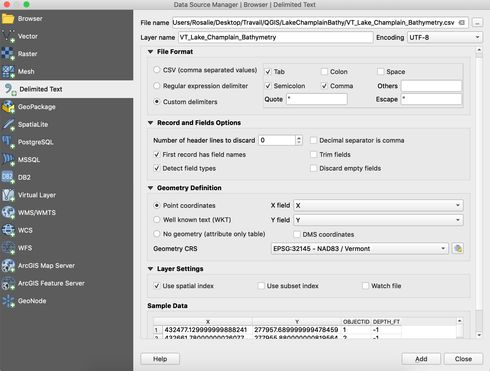

Select the path to your file in the 'File name' field. You may customize the name of the new layer you're about to create in the field below. QGIS 3 support several input format -- choose yours in the 'File Format' section. Select which column cary your longitude and latitude (X and Y) information in the 'Geometry Definition'. Make sure the projection (Geometry CRS) correspond to those of your data.

At all time, you can use the 'Sample Data' preview to make sure your imported data look good.
When you're done, click 'Add'.

You created a new layer, that appears in the bottom left pannel. If you zoom in, you'll see it's made of several points. You can get more information on each point by using the Identify Features option .  


<a name="transformdata"></a> 

#### 3. *(Optional)* Transform your data

Remember, our depth are given in feet. I want to convert them in meters ~~because the system makes so much more sense~~ so the data can be directly used in future publications. We can do that directly in QGIS.

Open the field calculator by clicking on the following icon: . Here, we want to create a new field, so we're filling out the left side. We will call our depth in meters Z. In order to be sure we write the equation correctly, we can use the drop-down menu in the middle. In the 'Fields and values' category, you'll find the existing fields. Double-click on the current depth, and it will appear in the left window. We then  only have to convert it in meters using the relation 1 foot = 0.3048 meter.  
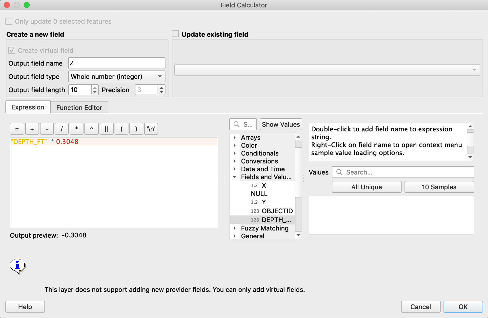

If you use the 'Identify Features' option described in the previous section, you will see that a new value is available for each point. Another way to visualise is to open the attribute table, using .


<a name="TIN"></a> 

#### 4. TIN Interpolation

<p style="border:3px; border-style:solid; border-color:#287EC7;; padding: 1em;"> <a href=http://www.qgistutorials.com/en/docs/interpolating_point_data.html target="_blank">From Ujaval Gandhi post</a>: <br> Interpolation results can vary significantly based on the method and parameters you choose. QGIS interpolation supports Triagulated Irregular Network (TIN) and Inverse Distance Weighting (IDW) methods for interpolation. TIN method is commonly used for elevation data whereas IDW method is used for interpolating other types of data such as mineral concentrations, populations etc. </p>

Before anything, unzoom to cover the extent of your data -- this will be useful in a minute. You can do that by clicking on 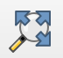.

In order to create a bathymetry, we need to interpolate between each discrete data to get a continuous information. This is one of the big differences between QGIS v2, where the interpolation was accessible through a plugin, and QGIS v3, where interpolations methods are implemented.  

Select Processing / Toolbox / Interpolation / TIN Interpolation.
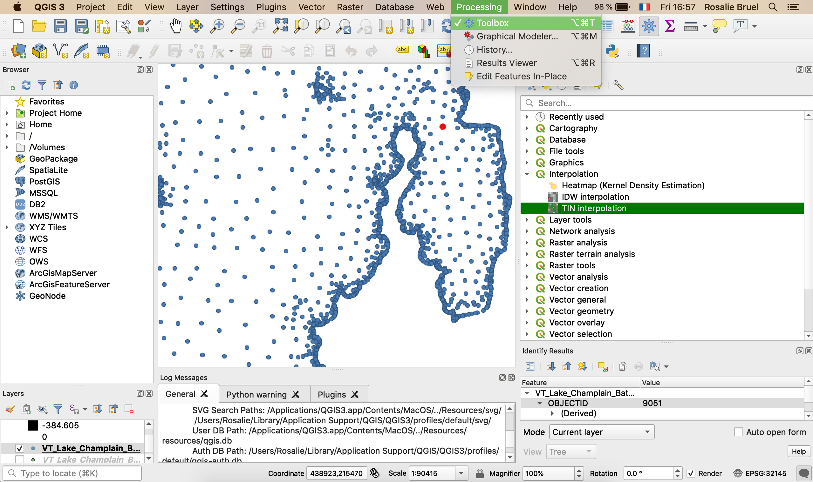

Here, you need to select the layer you just uploaded (the .csv file). In the 'Interpolation attribute', select the column where depth is given. Make sure to add this layer by clicking on the + sign.
For the extent of your interpolation, select 'Use Canvas Extent' (this is why we unzoomed earlier).
Choose a pixel resolution. My default is 0.10000 (shown in the print screen below), but this would take way too long for a large lake such as Lake Champlain (and I don't need that precision). I change this value to 10, but feel free to change this value depending on your system / your computer power.
Finally, name and give a location to save your output in the 'Interpolated' field.
Click 'Run'.


You just created your new TIN layer.

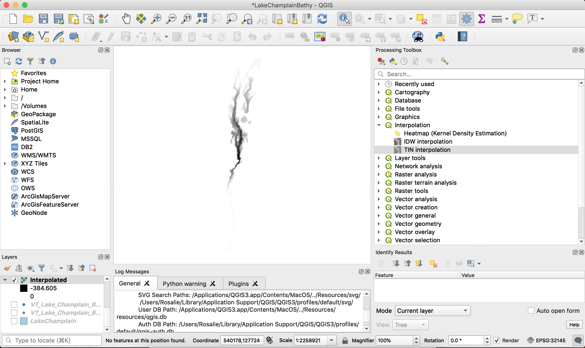


<a name="area"></a> 

#### 5. Delimitation to the correct area
__When trying to do this next step for the message, I got an error. Apparently, it's an issue with QGIS 3 on Macs, and I found the solution to the problem <a href="https://gis.stackexchange.com/questions/276853/gdal-scripts-not-found-in-qgis-3-on-osx" target="_blank">here</a>. Basically, you need to add a path to your system environment.__  

Pasting here the solution in case the discussion disappear...
Go to Settings ... Options... System ... Environment Enable "Use Custom Variables "
First select "Prepend", under variable enter "PATH", under value enter
"/Library/Frameworks/GDAL.framework/Programs:/Library/Frameworks/Python.framework/Versions/3.6/bin:"
(all these without the quotes)

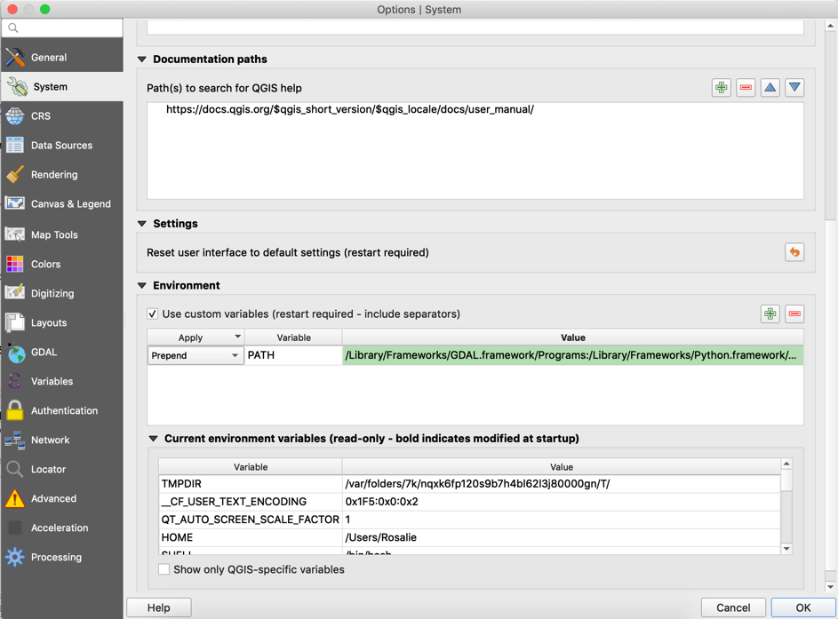

__Back to the interpolation.__

Interpolation does not give accurate results outside the collection area. You need to clip the surface with the lake boundary. Go to Raster / Extraction / Clip raster by mask layer. Here, you have to select your shape file contour of the lake for the Mask layer. Again, make sure to save your output to your files.
Click 'Run'.

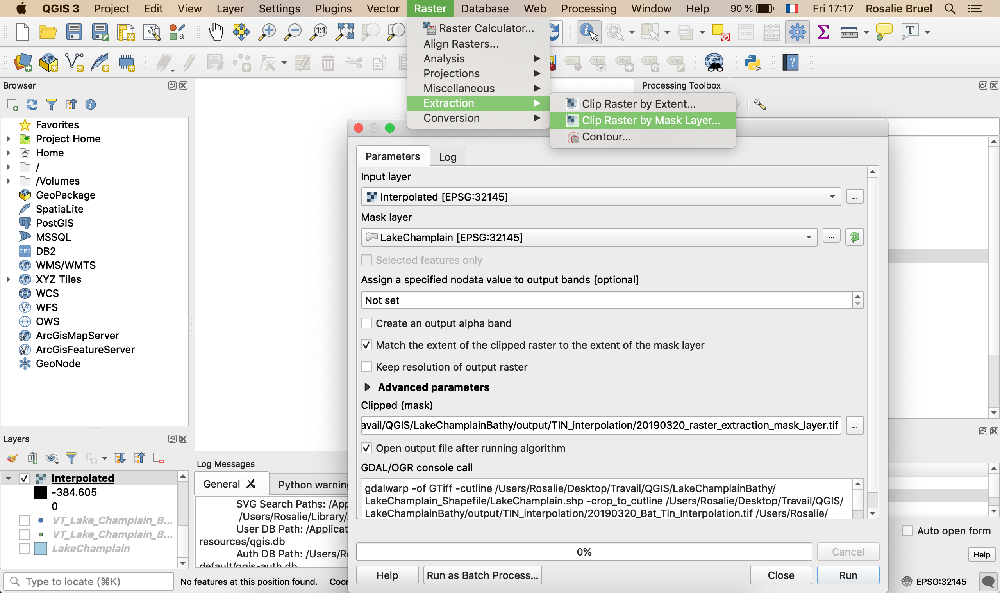

<a name="elevation"></a> 

#### 6. Visualise the different elevations
A new layer was created. Right-click on it, and got to properties.  
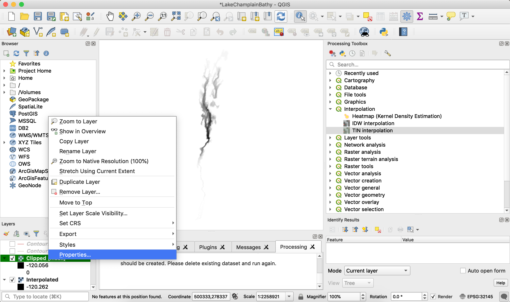

In there, select 'Singleband pseudocolor), and choose a Color ramp. With the 'Mode' drop-down menu, you can select the number of classes. Click 'OK', to get your new visual


<a name="contourlines"></a> 

#### 7. Generate contour lines
Select the clipped layer (the one we just created), and go to Raster > Extraction > Contour. This window allows you to chose the interval between contour lines (here I have it set to 10) and save your output.

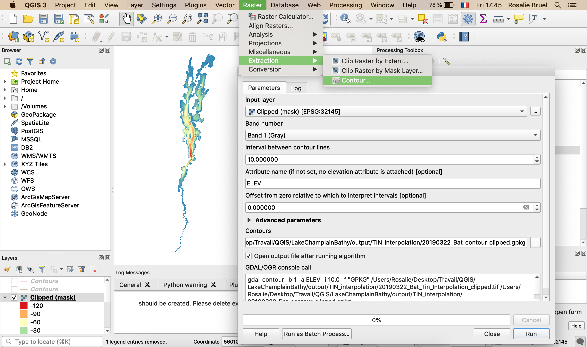

A new layer is created. I did it as well for a 20 interval; the output is shown below, zoomed in onto the Main Lake and Mallet's Bay.

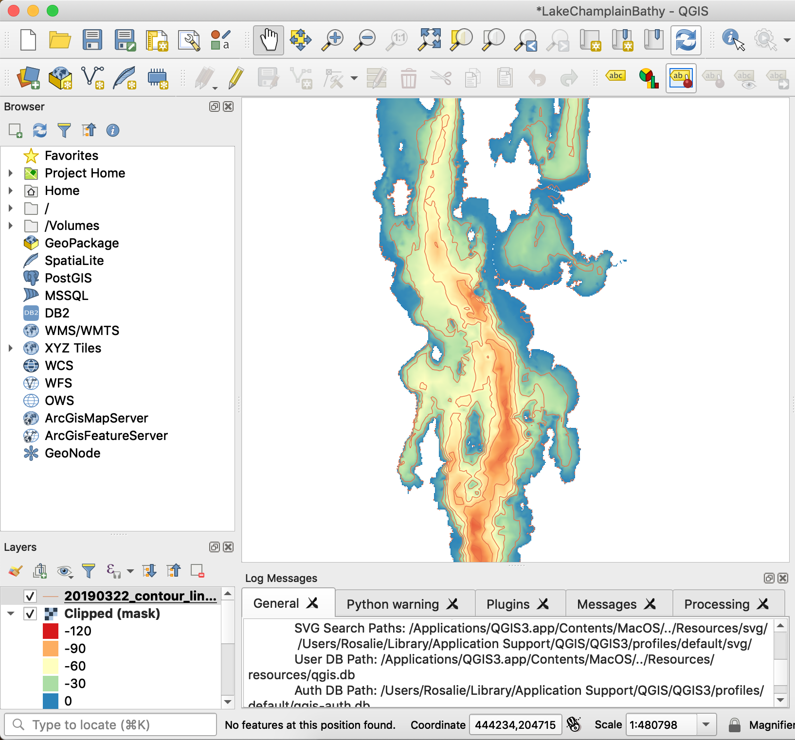

<a name="labels"></a> 

#### 8. Add the labels
I was about to stop this tutorial here, but went back to the one I've been using for QGIS 2 and noticed the author included the label as well -- good point!
In QGIS 3, the procedure stays the same. Select your contour layer, click right, Properties. Go to Labels, select 'Single labels', in the 'Label with', select ELEV, and change the placement to curved. Click 'OK'. Each contour line will be labeled with its depth

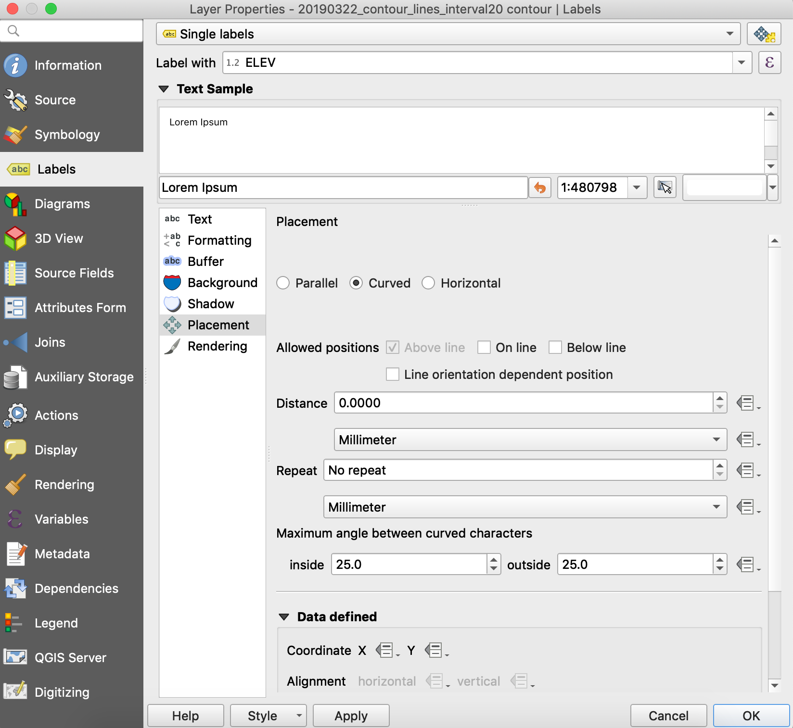

<a name="source"></a> 

#### Source  
At the moment, this tutorial is totally based on the <a href=http://www.qgistutorials.com/en/docs/interpolating_point_data.html target="_blank"> tutorial by Ujaval Gandhi, for previous versions of QGIS</a>. I documented these steps for me at first, and thought I might as well share them, but I'm definitely not a Geograph.

Table of content created using <a href=https://www.garrickadenbuie.com/blog/add-a-generated-table-of-contents-anywhere-in-rmarkdown/ target="_blank">this method</a>.


</div>


<a name="comments"></a> 

<!-- begin wwww.htmlcommentbox.com -->
 <div id="HCB_comment_box"><a href="http://www.htmlcommentbox.com"></a> is loading comments...</div>
 <link rel="stylesheet" type="text/css" href="https://www.htmlcommentbox.com/static/skins/bootstrap/twitter-bootstrap.css?v=0" />
 <script type="text/javascript" id="hcb"> /*<!--*/ if(!window.hcb_user){hcb_user={};} (function(){var s=document.createElement("script"), l=hcb_user.PAGE || (""+window.location).replace(/'/g,"%27"), h="https://www.htmlcommentbox.com";s.setAttribute("type","text/javascript");s.setAttribute("src", h+"/jread?page="+encodeURIComponent(l).replace("+","%2B")+"&opts=16862&num=10&ts=1553273262432");if (typeof s!="undefined") document.getElementsByTagName("head")[0].appendChild(s);})(); /*-->*/ </script>
<!-- end www.htmlcommentbox.com -->

