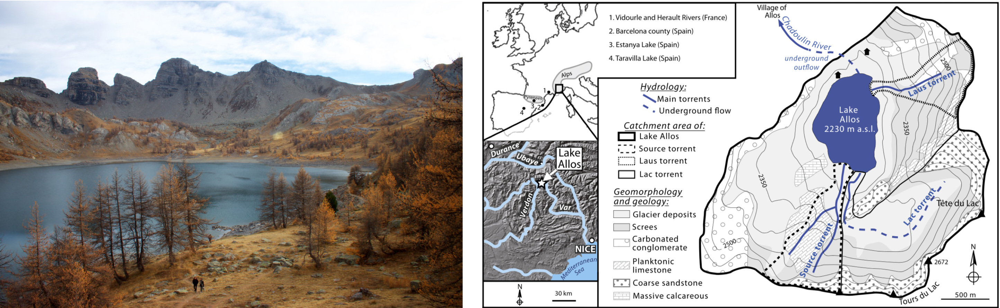

<!-- Global site tag (gtag.js) - Google Analytics -->
<script async src="https://www.googletagmanager.com/gtag/js?id=UA-134870808-1"></script>
<script>
  window.dataLayer = window.dataLayer || [];
  function gtag(){dataLayer.push(arguments);}
  gtag('js', new Date());

  gtag('config', 'UA-134870808-1');
</script>

```{r include=FALSE}
source("render_toc.R")
```


<style>
.full-page{
  float: left;
  width: 70%;
  vertical-align: top;
  text-align: left;
  margin-left: 15%;
  margin-right: 15%;
}
.body {
  background-image: url("Cores/ALO09P12/ALO09P12.jpg");
  background-repeat: no-repeat;
  background-attachment: fixed;
  background-size: contain;
  background-position: 15%;
}
.content {
    padding:20px;
    width:710px;
    position:relative;
    background: rgb(204, 204, 204); /* Fallback for older browsers without RGBA-support */
    background: rgba(255,255,255, 0.85);
}
.Rchunk {
  width:80%;
  margin-right: 10%;
  margin-left: 10%;
  margin-bottom: 5px;
  margin-top: 5px;
  text-align:left;
  padding: 5px;
  font-family: "Courier New", Times, serif;
}
</style>

<a href="../blog.html"> Back </a>

<div class="body">

<div class="full-page content">

## serac: a R package for ShortlivEd RAdionuclide Chronology of recent sediment cores
<div style="text-align:right">
Rosalie Bruel  
*October 25^th^, 2020*
</div>

__Content__
```{r toc, echo=FALSE} 
render_toc("Tuto2_serac.Rmd")
```

```{r get data camp, message=FALSE, warning=FALSE, include=FALSE, paged.print=FALSE}
library(tutorial)
tutorial::go_interactive()
```

***  


Dating sediments is the first and critical step of any palaeo-study. Specifically, accurately dating the past century is crucial in palaeoclimate and palaeoecological studies because of the many socio-ecological changes that took place during that period. When annual varves are absent, short-lived radionuclides, based on the measurements of the activity of <sup>137</sup>Cs, <sup>241</sup>Am, <sup>210</sup>Pb, and <sup>226</sup>Ra, provide the most accurate and widely used age-depth model technique for the past century. 

The isotopes <sup>137</sup>Cs, <sup>241</sup>Am, <sup>210</sup>Pb, and <sup>226</sup>Ra are most commonly measured together using a non-destructive gamma-spectrometric analysis, allowing a direct determination of <sup>210</sup>Pb unsupported (<sup>210</sup>Pb<sub>ex</sub>) through the <sup>226</sup>Ra activity. Measurements are often stored in a spreadsheet, allowing computation of the age-depth model. Then, figures can be created and edited in a costly photo editor. 

Using spreadsheets for storing and computing age-depth models raises the issue of versionning, and increases the risk for errors. Furthermore, most of the common programs (for spreadsheet or photo editing) need a license, that not everyone can afford (think about someone in-between two jobs, with no affiliations).

Our package allows a systematic approach to producing chronologies for sediment cores using short-lived radionuclides (<sup>210</sup>Pb<sub>ex</sub>, <sup>137</sup>Cs, and <sup>241</sup>Am). The package is implemented in R (free and open source). Our code itself is open source. We included a number of arguments allowing beginners to tweak the code to edit the output (change in colors, font sizes, etc.), but more advanced users can fork our code from Github and edit it.

Several <sup>210</sup>Pb<sub>ex</sub> models are implemented in our package: 
<ul>
  <li>constant initial concentration (CIC),</li>
  <li>constant rate of supply (CRS),</li>
  <li>constant flux constant sedimentation rate (CFCS),</li>
  <li>piecewise versions of CRS and CFCS.</li>
</ul>
The steps are documented in our manuscript and in a vignettes you can access from R. In this blogpost I'm including a way for you to test the potential of the function (go directly to the bottom of this page).

#### 1. Get your data ready
The input format has to follow some codes, otherwise R will display an error message.

We are sharing within the package some example data from Lake Allos (France). You can use those to follow along, or based the input format on them. The publication by Wilhelm *et al* (2012) is accessible <a target="_blank" rel="noopener noreferrer" href=https://www.sciencedirect.com/science/article/pii/S0033589412000294>here</a>. <br>


<!-- <div style="width:100%; margin-right: 5px; margin-bottom: 5px; margin-top: 5px; font-size:80%; text-align:center;">__left__: Lake Allos (Source: Flickr); __right__: Location, hydrological, geological and geomorphological characteristics of Lake Allos and its catchment (Fig. 1 in Wilhelm et al 2012)</div> -->

,"/images/Tuto2/1_Allos_Flickr_Wilhelm2012.png")`)


Your dataset should follow a similar format than the one below. Only 4 columns are in fact mandatory:
* top and bottom section of the sample OR average depth and thickness
* ^210^Pb~ex~ and error on ^210^Pb~ex~

With these information, you can compute a simple CRS model. Other models require to add the density.

```{r read and visualize data, echo=FALSE}
alo <- read.table(paste0(getwd(),"/Cores/ALO09P12/ALO09P12.txt"), header=T)
alo
```


#### 2. Download serac
You can download *serac* from my GitHub repository using the packages devtools.  

<div class="Rchunk">
install.packages(devtools) </br>
devtools::install_github('rosalieb/serac',  build_vignettes = TRUE) </br> 
library(serac) 
</div>


#### 3. Test your hypotheses
At the minimum, your function will be:  
<div class="Rchunk">
serac(name='serac_example_ALO09P12',coring_yr=2009)
</div>


Several sedimentation hypotheses were tested, and this is what the author chose as the best model:

<div class="Rchunk" >
serac(name='ALO09P12', coring_yr=2009, model=c('CFCS'), plotphoto=FALSE, minphoto=c(0), maxphoto=c(210), plot_Pb=T, plot_Am=T, plot_Cs=T, Cher=c(30,40), Hemisphere=c('NH'), NWT=c(51,61), sedchange=c(75.5), plot_Pb_inst_deposit=T, inst_deposit=c(20,28,100,107,135,142,158,186), suppdescriptor=TRUE, descriptor_lab=c('Ca/Fe'), historic_d=c(20,28,100,107,135,142,158,186), historic_a=c(1994,1920,1886,1868), historic_n=c('sept 1994 flood','1920 flood','1886 flood','1868 flood ?'), min_yr=c(1750),dmax=c(180), plotpdf=TRUE,preview=F)  
</div>


Here the output plot:

<!--  -->

,"/Cores/ALO09P12/ALO09P12.png")`)


Serac allows to test several type of sedimentation hypotheses: 
<ul>
<li>constant initial concentration (CIC),</li> 
<li>constant rate of supply (CRS), </li> 
<li>constant flux constant sedimentation rate (CFCS),</li>
</ul>
as well as  piecewise versions of CRS and CFCS.

Refer to the example in our paper to see the extent of model hypotheses you can test. And please, let us know if you see any issues with the package by sending us an email!

<!--
In this tutorial, I'm using the console powered by DataCamp, so I'm just loading the script. It might be too slow for it to really work, so I would recommend you try it in a real R session, following the steps in the <a target="_blank" rel="noopener noreferrer" href="serac_vignette.html"> vignette </a>. -->

```{r load packages, eval=FALSE, include=FALSE}
mywd <- "https://raw.githubusercontent.com/rosalieb/rosaliebruelweb/master/Blog_articles/"
pkgTest <- function(x)
{
  if (!require(x,character.only = TRUE))
  {
    install.packages(x,dep=TRUE)
    if(!require(x,character.only = TRUE)) stop("Package not found")
  }
}
# note for later: copy a raw version of serac code in the website repository, and include the pkgTest function
library(httr) # to read data from GitHub
library(RCurl) # to read script from GitHub

script <- getURL("https://raw.githubusercontent.com/rosalieb/serac/master/R/serac.R", ssl.verifypeer = FALSE)

eval(parse(text = script))


## Line below will create the 'Cores' folder if it doesn't exist already
dir.create(file.path(getwd(), 'Cores'), showWarnings = FALSE)

# Within the 'Cores' folder, user need to create one folder per core
dir.create(file.path(paste(getwd(),'/Cores',sep=""), 'serac_example_ALO09P12'), showWarnings = FALSE)

## We are writing in this subfolder an example dataset
## Format your own data following this template, or get help with formatting using
#    the serac_input_formatting() function
#?serac_example_ALO09P12
write.table(x = paste0(mywd,"Cores/serac_example_ALO09P12.txt"), file = paste0(getwd(),'/Cores/serac_example_ALO09P12/serac_example_ALO09P12.txt'),col.names = T, row.names = F,sep="\t")
## Including proxy data for this core too
write.table(x = paste0(mywd,"Cores/serac_example_ALO09P12_proxy.txt"), file = paste0(getwd(),'/Cores/serac_example_ALO09P12/serac_example_ALO09P12_proxy.txt'),col.names = T, row.names = F,sep="\t")

list.files()
list.files("Cores")
## Now run serac
## At the minimum, your function will be:
#serac(name="serac_example_ALO09P12",coring_yr=2009)

## Several sedimentation hypotheses were tested, and this is what the author chose
#    as the best model
#serac(name="serac_example_ALO09P12",coring_yr=2009,model=c("CFCS"),plotphoto=FALSE,minphoto=c(0),maxphoto=c(210),plot_Pb=T,plot_Am=T,plot_Cs=T,Cher=c(30,40),Hemisphere=c("NH"),NWT=c(51,61),sedchange=c(75.5),plot_Pb_inst_deposit=T,inst_deposit=c(20,28,100,107,135,142,158,186),suppdescriptor=TRUE,descriptor_lab=c("Ca/Fe"),historic_d=c(20,28,100,107,135,142,158,186),historic_a=c(1994,1920,1886,1868),historic_n=c("sept1 994 flood","1920 flood","1886 flood","1868 flood ?"), min_yr=c(1750),dmax=c(180), plotpdf=TRUE,preview=F)
## If you want to see the preview, change preview=T in the code
## Before that, make sure to extend your window in RStudio (large plot!)


```


#### 4. Citation and references  

To cite our method, please use: Bruel, R., Sabatier, P., 2020. serac: A R package for ShortlivEd RAdionuclide chronology of recent sediment cores. Journal of Environmental Radioactivity 225, 106449. <a href="https://doi.org/10.1016/j.jenvrad.2020.106449" target="_blank"> https://doi.org/10.1016/j.jenvrad.2020.106449</a>

Refer to the package's <a href="Tuto2_vignette.html" target="_blank">vignette</a> for more details. 

_Table of content created using <a href="https://www.garrickadenbuie.com/blog/add-a-generated-table-of-contents-anywhere-in-rmarkdown/" target="_blank">this method</a>._


</div>


<!-- begin wwww.htmlcommentbox.com -->
 <div id="HCB_comment_box"><a href="http://www.htmlcommentbox.com"></a> is loading comments...</div>
 <link rel="stylesheet" type="text/css" href="https://www.htmlcommentbox.com/static/skins/bootstrap/twitter-bootstrap.css?v=0" />
 <script type="text/javascript" id="hcb"> /*<!--*/ if(!window.hcb_user){hcb_user={};} (function(){var s=document.createElement("script"), l=hcb_user.PAGE || (""+window.location).replace(/'/g,"%27"), h="https://www.htmlcommentbox.com";s.setAttribute("type","text/javascript");s.setAttribute("src", h+"/jread?page="+encodeURIComponent(l).replace("+","%2B")+"&opts=16862&num=10&ts=1553273262432");if (typeof s!="undefined") document.getElementsByTagName("head")[0].appendChild(s);})(); /*-->*/ </script>
<!-- end www.htmlcommentbox.com -->

