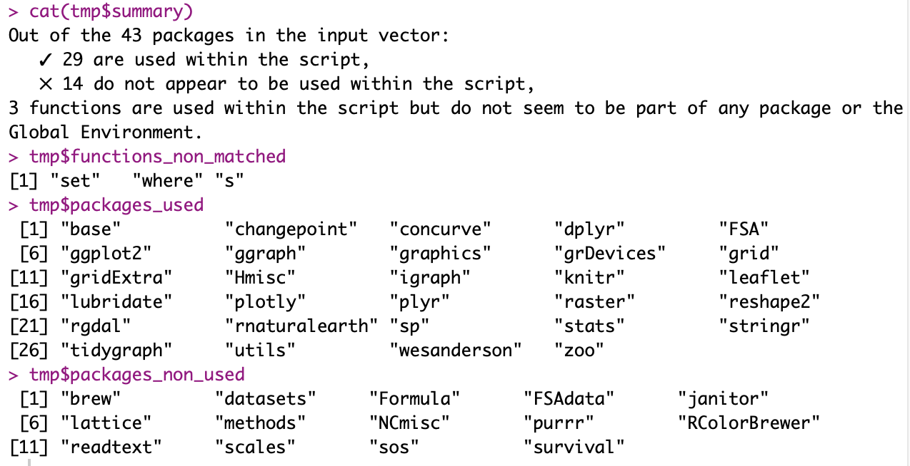

<!-- Global site tag (gtag.js) - Google Analytics -->
<script async src="https://www.googletagmanager.com/gtag/js?id=UA-134870808-1"></script>
<script>
  window.dataLayer = window.dataLayer || [];
  function gtag(){dataLayer.push(arguments);}
  gtag('js', new Date());

  gtag('config', 'UA-134870808-1');
</script>

```{r load packages,  include=FALSE}
library(knitr)
titlenb=0 # reset title number
```


<style>
.full-page{
  float: left;
  width: 70%;
  vertical-align: top;
  text-align: left;
  margin-left: 15%;
  margin-right: 15%;
}
.body {
  background-image: url("images/Tuto1/LC_Bathy.JPG");
  background-repeat: no-repeat;
  background-attachment: fixed;
  background-size: contain;
  background-position: center;
}
.content {
    padding:20px;
    width:710px;
    position:relative;
    background: rgb(204, 204, 204); /* Fallback for older browsers without RGBA-support */
    background: rgba(255,255,255, 0.85);
}

/* The sidebar menu */
.sidenav {
  position: fixed;
  padding: 8px 0;
}


/* Style all font awesome icons */
.fa {
  padding: 10px;
  font-size: 30px;
  width: 30px;
  text-align: center;
  text-decoration: none;
  border-radius: 50%;
}

/* Add a hover effect if you want */
.fa:hover {
  opacity: 0.7;
}

</style>


<div class="body">


<div class="full-page content">


<a name="#top"></a> 

<div class="header" id="myHeader">
  <h2>Less</h2> (unnecessary packages loaded) <h2>is more</h2>(RAM for your other analyses)
</div>

<div style="text-align:right">
Rosalie Bruel  
*October 14^th^, 2019*
</div>


  
***  
<a href="../blog.html"> ↩︎ Back </a>


## `r (titlenb <- titlenb+1)`. Problem

Last year I asked twitter for a solution for identifying packages that are no longer needed in a script.

<blockquote class="twitter-tweet"><p lang="en" dir="ltr">Is there a way in <a href="https://twitter.com/rstudio?ref_src=twsrc%5Etfw">@rstudio</a> to know which packages are not needed anymore to run a script?<br>I typically install &amp; load many packages when I&#39;m trying out analyses, and sometimes forget why they&#39;re made for initially 😶... Alternatively: how do you manage this issue? <a href="https://twitter.com/hashtag/rstats?src=hash&amp;ref_src=twsrc%5Etfw">#rstats</a></p>&mdash; Rosalie Bruel (@RosalieBruel) <a href="https://twitter.com/RosalieBruel/status/998558472533938176?ref_src=twsrc%5Etfw">May 21, 2018</a></blockquote> <script async src="https://platform.twitter.com/widgets.js" charset="utf-8"></script> 


User @jmcphers recommended <a href="https://github.com/rstudio/packrat"> *packrat*</a>, which I used for one of my project. *packrat* is great to keep track of the package version needed to run a script, but I don't like that it creates a copy of each package: it means I had to re-download all the packages needed for this specific project. It is just too much for my needs.


I re-thought about this issue today, and realized there might be another easy solution.


I wrote the function *lessismore()* to hopefully tackle this. I don't have time to package it, but you can load it using the code below:

```source("https://raw.githubusercontent.com/rosalieb/miscellaneous/master/R/lessismore.R")```


## `r (titlenb <- titlenb+1)`. Rapid overview

The function require the package <a href="https://cran.r-project.org/web/packages/sos/index.html">*sos*</a>.

I edited the code from Nicholas Cooper's package <a href="https://rdrr.io/cran/NCmisc/">NCmisc</a>. He has a lot of great function in there. I didn't reuse his function _"list.functions.in.file()"_ because I wanted to keep the information on how many times each function was used + his code does not work with .Rmd, so I had to edit that anyway.

For each function that was not associated to a package, I conducted a second search with sos::findFn(), that uses <a href="https://www.rdocumentation.org/packages/utils/versions/3.6.1/topics/RSiteSearch">Rsitesearch</a> for matches in vignettes, help pages, or task views. This one takes longer, so that's why I did not use that function systematically (and first went through the option coded in base R).

_lessismore()_ will also return any function that was not matched. It might be because some of the code was uncorrectly identified as functions though.

Arguments of the function are: <br>

Arguments   | Description                    | Example                
------------|--------------------------------|----------------------------- 
packages    | year(plktn\$VisitDate[1])      | .packages()
path2file   | path to file. Extensions can be .R or .Rmd. If .Rmd, will extract the code from the chunks using the _knitr_ library | "my_wd/file.R" / "my_wd/file.Rmd"    
plot_output | whether you want to visualize a plot showing the most used functions. If TRUE, will also require _ggplot2_ and _plotly_  | FALSE 
thresh      | threshold, for packages that may be using the same names than really frequent functions | 2         

I added the threshold argument (*thresh*) at the last minute. I noticed that some functions are used in so many packages that the function becomes not useful. For example, *plot()* is used in the packages raster, sp, changepoint, graphics, and in base R. I'm not sure this "threshold" solves all the problem, but it might help a bit.

##  `r (titlenb <- titlenb+1)`. Example

I tried the script on a R markdown file I am currently working on. Here, I am trying to see whether all the packages I have loaded for this session (.packages()) are needed in the script which pathname is "R/EwE_model_param_LakeChamplain.Rmd", and I want to plot which are the functions I used the most (plot_output = T).

```tmtp <- lessismore(packages = .packages(), 
                ath2file = "R/EwE_model_param_LakeChamplain.Rmd", 
                lot_output = T)`
```

Here is the result: <br>



I found that 14 packages are loaded and but not used in this script. I am using some of these on other scripts I worked on today, but I don't need *readtext* for example (I loaded it as I was writing the _lessismore()_ function).

However, I am using FSAdata! I call at some point the dataset ```FSAdata::TroutperchLM1```. The function does not work for objects which token is different from "SYMBOL_FUNCTION_CALL". If I or someone else ever want to update the function, that could be an aspect to improve.

## `r (titlenb <- titlenb+1)`. Summing up

Eventually, instead of looking at all packages I have loaded (with .packages()), I should use a vector of the packages I load at the beginning of my Rmarkdown.

Bonus, you can have a look at the most-used functions in your script:

```{r plot fun, echo=FALSE, message=FALSE, warning=FALSE}
summ_fun <- read.delim("Data/Tuto6_summ_fn.txt")
require("ggplot2")
require("plotly")
summ_fun$name <- rownames(summ_fun)
summ_fun$index <- 1:nrow(summ_fun)
summ_fun <- summ_fun[order(summ_fun$count, decreasing = T),]
p <- ggplot(summ_fun, aes(index,count, label=summ_fun$name)) + geom_point() + geom_line() +
            theme_bw() + labs(x="Index", y="Count", title="Occurence of each function in the script \n(Hoover to see name of the functions)")
ggplotly(p)
```


My most-used function is _c()_, used to create vectors --- nothing fancy here 😒.


Let me know if you end up using the function, if it's working or not, and if you have ideas to make the function more efficient!


<script>
window.onscroll = function() {myFunction()};

var header = document.getElementById("myHeader");
var sticky = header.offsetTop;

function myFunction() {
  if (window.pageYOffset > sticky) {
    header.classList.add("sticky");
  } else {
    header.classList.remove("sticky");
  }
}
</script>

<a name="comments"></a> 

<!-- begin wwww.htmlcommentbox.com -->
 <div id="HCB_comment_box"><a href="http://www.htmlcommentbox.com"></a> is loading comments...</div>
 <link rel="stylesheet" type="text/css" href="https://www.htmlcommentbox.com/static/skins/bootstrap/twitter-bootstrap.css?v=0" />
 <script type="text/javascript" id="hcb"> /*<!--*/ if(!window.hcb_user){hcb_user={};} (function(){var s=document.createElement("script"), l=hcb_user.PAGE || (""+window.location).replace(/'/g,"%27"), h="https://www.htmlcommentbox.com";s.setAttribute("type","text/javascript");s.setAttribute("src", h+"/jread?page="+encodeURIComponent(l).replace("+","%2B")+"&opts=16862&num=10&ts=1553273262432");if (typeof s!="undefined") document.getElementsByTagName("head")[0].appendChild(s);})(); /*-->*/ </script>
<!-- end www.htmlcommentbox.com -->

</body>