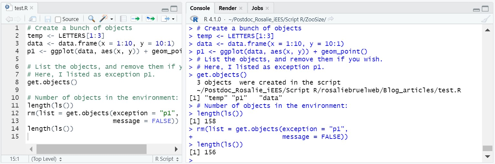

<!-- Global site tag (gtag.js) - Google Analytics -->

```{=html}
<script async src="https://www.googletagmanager.com/gtag/js?id=UA-134870808-1"></script>
```
```{=html}
<script>
  window.dataLayer = window.dataLayer || [];
  function gtag(){dataLayer.push(arguments);}
  gtag('js', new Date());

  gtag('config', 'UA-134870808-1');
</script>
```
```{r load packages,  include=FALSE}
library(knitr)
titlenb=0 # reset title number
```

```{=html}
<style>
.full-page{
  float: left;
  width: 70%;
  vertical-align: top;
  text-align: left;
  margin-left: 15%;
  margin-right: 15%;
}
.body {
  background-image: url("images/Tuto1/LC_Bathy.JPG");
  background-repeat: no-repeat;
  background-attachment: fixed;
  background-size: contain;
  background-position: center;
}
.content {
    padding:20px;
    width:710px;
    position:relative;
    background: rgb(204, 204, 204); /* Fallback for older browsers without RGBA-support */
    background: rgba(255,255,255, 0.85);
}

/* The sidebar menu */
.sidenav {
  position: fixed;
  padding: 8px 0;
}


/* Style all font awesome icons */
.fa {
  padding: 10px;
  font-size: 30px;
  width: 30px;
  text-align: center;
  text-decoration: none;
  border-radius: 50%;
}

/* Add a hover effect if you want */
.fa:hover {
  opacity: 0.7;
}

</style>
```
<div class="body">

<div class="full-page content">

<a name="#top"></a>

::: {#myHeader .header}
<h2>

Get a vector of objects created within in an .R or .Rmd file

</h2>
:::

::: {style="text-align:right"}
Rosalie Bruel\
*June 10^th^, 2022*
:::

------------------------------------------------------------------------

<a href="../blog.html"> ↩︎ Back </a>

## `r (titlenb <- titlenb+1)`. Problem

I appreciate the functionality in RStudio that keeps in memory (.RDataTemp files) objects created at previous steps, even when closing RStudio. I find this functionality useful when I have a script that takes a while to run, for which the output is useful but not necessarily *that* useful that I want to permanently save it to a local file.

However, on occasion, I have scripts I need to run once and that's it. At the end of said script, I would like to be able to remove from the environment any object that was created by the script. In other words, I would like to be able to use rm(), but instead of doing it for the whole environment (\`ls()\`), I would like to do it for the environment of a specific script.

I wrote the function *get.objects.from.script()* to tackle this. You can load the function using the code below:

```{r klippy, echo=FALSE, include=TRUE}
#remotes::install_github("rlesur/klippy")
klippy::klippy('')
```

```{r eval=FALSE, include=TRUE, class.source='klippy'}
source("https://raw.githubusercontent.com/rosalieb/miscellaneous/master/R/get.objects.from.script.R")
```

## `r (titlenb <- titlenb+1)`. Easy alternatives and why they did not fit my needs

### `r titlenb`.1. Alternative 1: list objects before and after running the script

One easy way could be to list the files in the environment at the beginning of a script, and list the files after having ran the script, and do the differential of objects. For example, see the script below:

```{r eval=FALSE, include=TRUE, class.source='klippy'}
# Start script
initial_objects <- ls()

# Create a bunch of objects
temp <- LETTERS[1:3]
data <- data.frame(x = 1:10, y = 10:1)
p1 <- ggplot(data, aes(x, y)) + geom_point()

# Remove only the objects that were created since initial_objects was last run
# 1. See what is returned: should include "initial_objects" "temp" "data" "p1"  
ls()[!ls() %in% initial_objects]
# 2. Remove these objects
rm(list = ls()[!ls() %in% initial_objects])
```

However, there are at least three scenarios I can think of in which the listed files (in `initial_objects`) wouldn't be the right ones:

1.  If by mistake I forgot to run the first line \`initial_objects \<- ls()\`, it will be "too late" to go back, and I will end up having to list the objects manually.

2.  A variant: If by mistake I run the first line multiple times, after running the script a first time (for example, if I run everything above a certain line, or if I run "all chunks above" in a .Rmd).

3.  If there was already an element in the environment with the same name as an object created within the script. I frequently use some names across scripts, for objects I will not keep. For example, I use "temp" for a temporary object, "p1" for a plot, "out" for an output object that I would populate within a loop, etc. If I already have an object "temp" in the environment, it won't be removed using the method above. However, it is not something I need to keep per my requirements stated in the section "problem".

### `r titlenb`.2. Alternative 2: run the script in its own environment  

A second option would be to run the script in its own environment, which is possible when sourcing a file. 

```{r eval=FALSE, include=TRUE, class.source='klippy'}
my_env <- new.env()  
source("myscript.R", my_env)  
rm(my_env)  
```

However, this would only work for a script I do not need to run line by line to visualize the output. This solution does not fit my exact needs either.

## `r (titlenb <- titlenb+1)`. A rapid overview of the function get.objects.from.script()

The function is pretty simple, and follows three steps:

1.  Screening through the current script (although you could also set the path to another script if you want). This part relies on the function `getParseData()` from the library *utils*.

2.  Keep only the objects (token = "SYMBOL").

3.  Find and return which objects are in the Global Environment.

The function returns all the objects created in the script. You can then run `rm()`, except that instead of removing everything from the environment (`rm(list = ls())`), you can choose to remove only the objects created within the current script:

```{r eval=FALSE, include=TRUE, class.source='klippy'}
rm(list = get.objects.from.script())
```


Arguments of the function are: <br>

| Arguments | Description                                                                                                                                                                                            | Example                           |
|------------------|----------------------------|--------------------------|
| path2file | path to file. Extensions can be .R or .Rmd. If .Rmd, will extract the code from the chunks using the *knitr* library                                                                                   | "my_wd/file.R" / "my_wd/file.Rmd" |
| exception | any objects that you wish to preserve. Default = NULL                                                                                                                                                  | c("output", "p1")                 |
| source    | logical argument, indicating whether to source the script before running the function. It is a necessary condition to run the script first so that objects appear in the environment. Default = FALSE. | FALSE                             |
| message   | logical argument, indicating whether to print a message or not. Default = TRUE                                                                                                                         | TRUE                              |

## `r (titlenb <- titlenb+1)`. Example

Here is an example. Note that the code below must be saved as a script. <br>

```{r eval=FALSE, include=TRUE, class.source='klippy'}
source("https://raw.githubusercontent.com/rosalieb/miscellaneous/master/R/get.objects.from.script.R")

# Create a bunch of objects
temp <- LETTERS[1:3]
data <- data.frame(x = 1:10, y = 10:1)
p1 <- ggplot(data, aes(x, y)) + geom_point()

# List the objects in the current script
get.objects.from.script()

# Number of objects in the environment before the function:
length(ls()) # 158
# Remove all the objects in the script (as obtained by 
#   get.objects.from.script(), with the exception of "p1"
#   as specified by the argument 'exception = "p1"'.
rm(list = get.objects.from.script(exception = "p1",
                      message = FALSE))
# Number of objects in the environment after running the function
length(ls()) # 156 (we decided to keep "p1", so only two objects were removed)
```

Here is the what it looks like if you run it: <br>



It work well: with `get.objects.from.script()`, I do find the objects I just created. On the following line, I am able to remove these objects, but also include exception (e.g., if I want to keep "p1" for example.)

```{=html}
<script>
window.onscroll = function() {myFunction()};

var header = document.getElementById("myHeader");
var sticky = header.offsetTop;

function myFunction() {
  if (window.pageYOffset > sticky) {
    header.classList.add("sticky");
  } else {
    header.classList.remove("sticky");
  }
}
</script>
```
<a name="comments"></a>

<!-- begin wwww.htmlcommentbox.com -->

::: {#HCB_comment_box}
<a href="http://www.htmlcommentbox.com"></a> is loading comments...
:::

<link rel="stylesheet" type="text/css" href="https://www.htmlcommentbox.com/static/skins/bootstrap/twitter-bootstrap.css?v=0" />

<script type="text/javascript" id="hcb"> /*<!--*/ if(!window.hcb_user){hcb_user={};} (function(){var s=document.createElement("script"), l=hcb_user.PAGE || (""+window.location).replace(/'/g,"%27"), h="https://www.htmlcommentbox.com";s.setAttribute("type","text/javascript");s.setAttribute("src", h+"/jread?page="+encodeURIComponent(l).replace("+","%2B")+"&opts=16862&num=10&ts=1553273262432");if (typeof s!="undefined") document.getElementsByTagName("head")[0].appendChild(s);})(); /*-->*/ </script>

<!-- end www.htmlcommentbox.com -->

</body>
