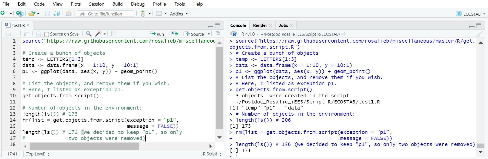

<!-- Global site tag (gtag.js) - Google Analytics -->

```{=html}
<script async src="https://www.googletagmanager.com/gtag/js?id=UA-134870808-1"></script>
```
```{=html}
<script>
  window.dataLayer = window.dataLayer || [];
  function gtag(){dataLayer.push(arguments);}
  gtag('js', new Date());

  gtag('config', 'UA-134870808-1');
</script>
```
```{r load packages,  include=FALSE}
library(knitr)
titlenb=0 # reset title number
```

```{=html}
<style>
.full-page{
  float: left;
  width: 70%;
  vertical-align: top;
  text-align: left;
  margin-left: 15%;
  margin-right: 15%;
}
.body {
  background-image: url("images/Tuto1/LC_Bathy.JPG");
  background-repeat: no-repeat;
  background-attachment: fixed;
  background-size: contain;
  background-position: center;
}
.content {
    padding:20px;
    width:710px;
    position:relative;
    background: rgb(204, 204, 204); /* Fallback for older browsers without RGBA-support */
    background: rgba(255,255,255, 0.85);
}

/* The sidebar menu */
.sidenav {
  position: fixed;
  padding: 8px 0;
}


/* Style all font awesome icons */
.fa {
  padding: 10px;
  font-size: 30px;
  width: 30px;
  text-align: center;
  text-decoration: none;
  border-radius: 50%;
}

/* Add a hover effect if you want */
.fa:hover {
  opacity: 0.7;
}

</style>
```
<div class="body">

<div class="full-page content">

<a name="#top"></a>

::: {#myHeader .header}
<h2>

get.objects()

</h2>
:::

::: {style="text-align:right"}
Rosalie Bruel\
*June 8^th^, 2022*
:::

------------------------------------------------------------------------

<a href="../blog.html"> ↩︎ Back </a>

## `r (titlenb <- titlenb+1)`. Problem

I am **not** good at keeping my RStudio environment tidy. I think being able to keep in memory dataset previously created is just too good of a feature not to use it.

However, on occasion, I have scripts I need to run once and that's it. At the end of said script, I would like to remove any object that was created from the environment.

In other words, I would like to be able to use rm(), but instead of doing it for the whole environment (\`ls()\`), I would like to do it for a specific script.

I wrote the function *get.objects()* to tackle this. You can load the function using the code below:

```{r eval=FALSE, include=TRUE}
source("https://raw.githubusercontent.com/rosalieb/miscellaneous/master/R/get.objects.R")
```

## `r (titlenb <- titlenb+1)`. Rapid overview

The function is pretty simple, and follows three steps:

1.  Step 1: screening through the current script (although you could also set the path to another script if you want).

2.  Save all the objects.

3.  Find and return which objects are in the Global Environment.

You can then run

```{r eval=FALSE, include=TRUE}
rm(list = get.objects())
```

to remove the objects within a give script.


Arguments of the function are: <br>

| Arguments   | Description                                                                                                             | Example                           |
|------------------|-----------------------------|--------------------------|
| path2file   | path to file. Extensions can be .R or .Rmd. If .Rmd, will extract the code from the chunks using the *knitr* library    | "my_wd/file.R" / "my_wd/file.Rmd" |
| exception | any objects that you wish to preserve. Default = NULL | c("output", "p1")                             |
| source      | logical argument, indicating whether to source the script before running the function. It is a necessary condition to run the script first so that objects appear in the environment. Default = FALSE.                                  | FALSE                                 |
| message      | logical argument, indicating whether to print a message or not. Default = TRUE                                  | TRUE                                 |


## `r (titlenb <- titlenb+1)`. Example

Here is an example. Note that the code below must be saved as a script. <br>

```{r eval=FALSE, include=TRUE}
# Create a bunch of objects
temp <- LETTERS[1:3]
data <- data.frame(x = 1:10, y = 10:1)
p1 <- ggplot(data, aes(x, y)) + geom_point()

# List the objects, and remove them if you wish.
# Here, I listed as exception p1.
get.objects()

# Number of objects in the environment:
length(ls()) # 158
rm(list = get.objects(exception = "p1",
                      message = FALSE))
length(ls()) # 156 (we decided to keep "p1", so only two objects were removed)
```

Here is the what it looks like if you run it: <br>



It does work well: with `get.objects()`, I do find the  objects I just created. On the following line, I am able to remove these objects, but also include exception (e.g., if I want to keep p1 for example.)


```{=html}
<script>
window.onscroll = function() {myFunction()};

var header = document.getElementById("myHeader");
var sticky = header.offsetTop;

function myFunction() {
  if (window.pageYOffset > sticky) {
    header.classList.add("sticky");
  } else {
    header.classList.remove("sticky");
  }
}
</script>
```
<a name="comments"></a>

<!-- begin wwww.htmlcommentbox.com -->

::: {#HCB_comment_box}
<a href="http://www.htmlcommentbox.com"></a> is loading comments...
:::

<link rel="stylesheet" type="text/css" href="https://www.htmlcommentbox.com/static/skins/bootstrap/twitter-bootstrap.css?v=0" />

<script type="text/javascript" id="hcb"> /*<!--*/ if(!window.hcb_user){hcb_user={};} (function(){var s=document.createElement("script"), l=hcb_user.PAGE || (""+window.location).replace(/'/g,"%27"), h="https://www.htmlcommentbox.com";s.setAttribute("type","text/javascript");s.setAttribute("src", h+"/jread?page="+encodeURIComponent(l).replace("+","%2B")+"&opts=16862&num=10&ts=1553273262432");if (typeof s!="undefined") document.getElementsByTagName("head")[0].appendChild(s);})(); /*-->*/ </script>

<!-- end www.htmlcommentbox.com -->

</body>
