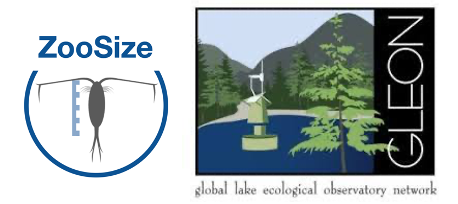

<!-- Global site tag (gtag.js) - Google Analytics -->

<!-- Sort table by multiple columns -->

<head>

<!-- tutorial on how to add a download button
https://www.w3schools.com/howto/tryit.asp?filename=tryhow_css_download_button  -->

<meta name="viewport" content="width=device-width, initial-scale=1">
<!-- Add icon library -->
<link rel="stylesheet" href="https://cdnjs.cloudflare.com/ajax/libs/font-awesome/4.7.0/css/font-awesome.min.css">

</head>
<body style="background-color:#fafafa">
<!---

--->
***  

### ZooSize project
***

<b>ZooSize GLEON project ZooSize</b> 

<i> > The data call closed in July 2023</i>

ZooSize aims to get well represented individual crustacean zooplankton body length measurements for freshwater lakes across global lake thermal regions to gain insights on the following fundamental research question: 

<big>How do size distributions of crustacean zooplankton communities differ across the globe and how are they influenced by bottom-up and top-down processes? </big>
  

Read more about our question, the data requirements, and authors guidelines in our collaboration guidelines. You can download the collaboration guidelines (.pdf) and data call form (.xslx) by clicking on the buttons below. If you have data for several lakes, you can either fill the template for one lake several times, or fill the multi-lakes template (links below). Feel free to email me or one of the other project champions (Maria Calderó-Pascual, Zeynep Ersoy, and Lauren Barth) for an example on how to fill in the data call if necessary.

_[Jan 2022 update]_  
We realized that there is quite a diversity in sample preservative used. If you have 5-minutes, could you please fill-in this <a href="https://forms.gle/bVuN1vk696Q84kZm6" target = "_blank">Google Form</a>, asking details about your method. We will use the answers to (1) issue a recommendation for new data providers, if they don't have a fixed SOP at their lab, and (2) assess the need for having a sub-group work on quantifying the size differences from a same sample when different methods have been used. Do not hesitate to share the form with your colleagues, as you don't have to be part of the project to answer! <a href="https://forms.gle/bVuN1vk696Q84kZm6" target="_blank" title="Access poll on the use of preservative"><button class="btn2"><i class="fas fa-external-link-alt"></i></i> POLL</button> </a>

<a href="files/CollaborationGuidelines_ZooSize.pdf" target="_blank" title="Download the data call instructions and authors guidelines"><button class="btn"><i class="fa fa-download"></i> Data call instructions and authors guidelines  </button>  </a>

<a href="files/LakeName_ZooSize.xlsx" target="_blank" title = "Download the single lake data template"><button class="btn"><i class="fa fa-download"></i> Data template - one lake</button></a>

<a href="files/MultiLake_ZooSize_DataProviderLastName.xlsx" target="_blank" title = "Download the multi-lakes lake data template"><button class="btn"><i class="fa fa-download"></i> Data template - multi lakes</button></a>

<a href="files/ZooSize_SOP_v2.0.pdf" target="_blank" title="Download the SOP"><button class="btn"><i class="fa fa-download"></i>SOP</button>  </a>

See the timeline of the project <a href="https://docs.google.com/spreadsheets/d/1ZhrLiPbk6Rtv4yf9AaFMTSjQwlWszxK3/edit#gid=925206033" target = "_blank">here</a>. Important dates:

- October 2020: GLEON 21.5 meeting - creation of the working group ZooSize
- August 2021: Data call
- December 2021: Deadline for submission of existing data
- February 2022: New project co-champion! We are welcoming Zeynep Ersoy :) 
- July 2023: Deadline for submission of data from new sampling efforts

### Contacts

Project champions: <a href="https://maria-caldero-pascual.netlify.app/" target="_blank">Maria Calderó-Pascual</a> (BETA Technological Center (UVic-UCC), Spain), <a href="https://rosalieb.github.io/rosaliebruelweb/index.html" target="_blank">Rosalie Bruel</a> (French Biodiversity Agency (OFB), France), <a href="https://zeynepersoy.com/" target="_blank">Zeynep Ersoy</a> (University of Rey Juan Carlos, Spain), Lauren Barth.

<!---
<a href='mailto:rosaliebruel@gmail.com,Maria.CalderoPascual@dkit.ie,zzeynepersoy@gmail.com,lauren.barth@utoronto.ca?subject=Information about the ZooSize project'>Email us</a> if you have any question on the project.

We (<a href="https://twitter.com/CalderoPM" target="_blank">@CalderoPM</a>, <a href="https://twitter.com/LimnoLauren" target="_blank">@LimnoLauren</a>, <a href="https://twitter.com/RosalieBruel" target="_blank">@RosalieBruel</a>, <a href="https://twitter.com/zzeynepersoy" target="_blank">@zzeynepersoy</a>) will tweet some project updates on Twitter with the tag #ZooSize. 
--->

 

<!--- 

<blockquote class="twitter-tweet">
<a href="https://twitter.com/GLEONetwork?ref_src=twsrc%5Etfw">@GLEONetwork</a> DATA CALL now open! Find <a href="https://twitter.com/hashtag/ZooSize?src=hash&amp;ref_src=twsrc%5Etfw">#ZooSize</a> project in <a href="https://t.co/SDRy9j9r1Q">https://t.co/SDRy9j9r1Q</a> <a href="https://twitter.com/hashtag/worldwide?src=hash&amp;ref_src=twsrc%5Etfw">#worldwide</a> <a href="https://twitter.com/hashtag/lake?src=hash&amp;ref_src=twsrc%5Etfw">#lake</a> <a href="https://twitter.com/hashtag/zooplankton?src=hash&amp;ref_src=twsrc%5Etfw">#zooplankton</a> <a href="https://twitter.com/hashtag/lenghts?src=hash&amp;ref_src=twsrc%5Etfw">#lenghts</a> Spread the word! <a href="https://twitter.com/RosalieBruel?ref_src=twsrc%5Etfw">@RosalieBruel</a> <a href="https://twitter.com/LimnoLauren?ref_src=twsrc%5Etfw">@LimnoLauren</a> <a href="https://twitter.com/SteveThackeray?ref_src=twsrc%5Etfw">@SteveThackeray</a> <a href="https://twitter.com/MECO_UniGe?ref_src=twsrc%5Etfw">@MECO_UniGe</a> <a href="https://twitter.com/PlanktonEcology?ref_src=twsrc%5Etfw">@PlanktonEcology</a> <a href="https://twitter.com/edeeyto?ref_src=twsrc%5Etfw">@edeeyto</a> <a href="https://twitter.com/MetuLimnology?ref_src=twsrc%5Etfw">@MetuLimnology</a> <a href="https://twitter.com/dvm_uvm?ref_src=twsrc%5Etfw">@dvm_uvm</a> <a href="https://twitter.com/MireiaBartrons?ref_src=twsrc%5Etfw">@MireiaBartrons</a> and many more THANKS! <a href="https://t.co/H37un4sM0u">pic.twitter.com/H37un4sM0u</a>
&mdash; Maria Calderó (@CalderoPM) <a href="https://twitter.com/CalderoPM/status/1426100249903390721?ref_src=twsrc%5Etfw">August 13, 2021</a></blockquote>  

<blockquote class="twitter-tweet">
Sadly we could not make it to <a href="https://twitter.com/hashtag/GLEON2022?src=hash&amp;ref_src=twsrc%5Etfw">#GLEON2022</a> but our poster didぉCheck our poster <a href="https://twitter.com/hashtag/ZooSize?src=hash&amp;ref_src=twsrc%5Etfw">#ZooSize</a> project- &quot;Crustacean zooplankton community size distributions across a worldwide set of freshwater lakes&quot; at poster session 1 today. More info here :<a href="https://t.co/607OgylyS4">https://t.co/607OgylyS4</a> <a href="https://t.co/IE0wIHFZ9K">pic.twitter.com/IE0wIHFZ9K</a>
&mdash; Zeynep Ersoy (@zzeynepersoy) <a href="https://twitter.com/zzeynepersoy/status/1587087568033779714?ref_src=twsrc%5Etfw">October 31, 2022</a></blockquote>  

<blockquote class="twitter-tweet">
We welcomed last month <a href="https://twitter.com/zzeynepersoy?ref_src=twsrc%5Etfw">@zzeynepersoy</a> as the new co-champion for the <a href="https://twitter.com/GLEONetwork?ref_src=twsrc%5Etfw">@GLEONetwork</a> project <a href="https://twitter.com/hashtag/ZooSize?src=hash&amp;ref_src=twsrc%5Etfw">#ZooSize</a>! Zeynep comes from Turkey and has been working in Spain and Portugal.  ZooSizes project: <a href="https://t.co/DIiTKNqBLZ">https://t.co/DIiTKNqBLZ</a> Zeyneps page: <a href="https://t.co/tVyi4bSEA2">https://t.co/tVyi4bSEA2</a><a href="https://twitter.com/CalderoPM?ref_src=twsrc%5Etfw">@CalderoPM</a> <a href="https://twitter.com/LimnoLauren?ref_src=twsrc%5Etfw">@LimnoLauren</a> <a href="https://t.co/uNbTROaYlZ">pic.twitter.com/uNbTROaYlZ</a>
&mdash; Rosalie Bruel (@RosalieBruel) <a href="https://twitter.com/RosalieBruel/status/1501881028390146048?ref_src=twsrc%5Etfw">March 10, 2022</a></blockquote>  

<blockquote class="twitter-tweet">
Last week we had our 6th <a href="https://twitter.com/hashtag/ZooSize?src=hash&amp;ref_src=twsrc%5Etfw">#ZooSize</a> general meeting co-championed by <a href="https://twitter.com/RosalieBruel?ref_src=twsrc%5Etfw">@RosalieBruel</a> <a href="https://twitter.com/zzeynepersoy?ref_src=twsrc%5Etfw">@zzeynepersoy</a> <a href="https://twitter.com/LimnoLauren?ref_src=twsrc%5Etfw">@LimnoLauren</a> <a href="https://twitter.com/CalderoPM?ref_src=twsrc%5Etfw">@CalderoPM</a> Already 17 <a href="https://twitter.com/hashtag/dataproviders?src=hash&amp;ref_src=twsrc%5Etfw">#dataproviders</a> 47 <a href="https://twitter.com/hashtag/lakes?src=hash&amp;ref_src=twsrc%5Etfw">#lakes</a> We presented preliminary analysis on <a href="https://twitter.com/hashtag/QCtaxanames?src=hash&amp;ref_src=twsrc%5Etfw">#QCtaxanames</a> <a href="https://twitter.com/hashtag/preservativesurvey?src=hash&amp;ref_src=twsrc%5Etfw">#preservativesurvey</a> <a href="https://twitter.com/hashtag/measurements?src=hash&amp;ref_src=twsrc%5Etfw">#measurements</a> <a href="https://twitter.com/hashtag/literaturereview?src=hash&amp;ref_src=twsrc%5Etfw">#literaturereview</a> on <a href="https://twitter.com/hashtag/zooplankton?src=hash&amp;ref_src=twsrc%5Etfw">#zooplankton</a> <a href="https://twitter.com/hashtag/size?src=hash&amp;ref_src=twsrc%5Etfw">#size</a> <a href="https://t.co/RfdoBf12lm">pic.twitter.com/RfdoBf12lm</a>
&mdash; Maria Calderó Pascual (@CalderoPM) <a href="https://twitter.com/CalderoPM/status/1523560593932046336?ref_src=twsrc%5Etfw">May 9, 2022</a></blockquote>  

--->

<!--

<blockquote class="twitter-tweet">
<a href="https://twitter.com/GLEONetwork?ref_src=twsrc%5Etfw">@GLEONetwork</a> <a href="https://twitter.com/hashtag/ZooSize?src=hash&amp;ref_src=twsrc%5Etfw">#ZooSize</a> project <a href="https://twitter.com/hashtag/datacall?src=hash&amp;ref_src=twsrc%5Etfw">#datacall</a> is still OPEN! Check it out: <a href="https://t.co/SDRy9j9r1Q">https://t.co/SDRy9j9r1Q</a> Perfect present for <a href="https://twitter.com/RosalieBruel?ref_src=twsrc%5Etfw">@RosalieBruel</a> <a href="https://twitter.com/LimnoLauren?ref_src=twsrc%5Etfw">@LimnoLauren</a> and all <a href="https://twitter.com/hashtag/collaborators?src=hash&amp;ref_src=twsrc%5Etfw">#collaborators</a>! Soon we will upload a <a href="https://twitter.com/hashtag/SOP?src=hash&amp;ref_src=twsrc%5Etfw">#SOP</a> for <a href="https://twitter.com/hashtag/zooplankton?src=hash&amp;ref_src=twsrc%5Etfw">#zooplankton</a> <a href="https://twitter.com/hashtag/microscope?src=hash&amp;ref_src=twsrc%5Etfw">#microscope</a> Could you share yours? <a href="https://twitter.com/hashtag/preservative?src=hash&amp;ref_src=twsrc%5Etfw">#preservative</a> <a href="https://twitter.com/hashtag/bodysize?src=hash&amp;ref_src=twsrc%5Etfw">#bodysize</a> <a href="https://t.co/4gvRgYwj5M">pic.twitter.com/4gvRgYwj5M</a>
&mdash; Maria Calderó Pascual (@CalderoPM) <a href="https://twitter.com/CalderoPM/status/1461408613159874568?ref_src=twsrc%5Etfw">November 18, 2021</a></blockquote>  

-->

 

 

### Project participants' section  

During the general meetings, we shared the link to a document with all the important documents and links (literature review, data analysis, etc.). If you need that link again, <a href='mailto:rosaliebruel@gmail.com,calderopascualm@gmail.com,zzeynepersoy@gmail.com?subject=ZooSize - general document with relevant links for the project &body=Dear ZooSize co-champions,%0D%0A %0D%0AI am a participant of the project and would like the link to the general document with all the relevant links.%0D%0A %0D%0AThanks,%0D%0A[your name and email]'>click here to email us</a> and request access.  

<!--
<a href='mailto:rosaliebruel@gmail.com,Maria.CalderoPascual@dkit.ie,zzeynepersoy@gmail.com,lauren.barth@utoronto.ca?subject=ZooSize - general document with relevant links for the project &body=Dear ZooSize co-champions,%0D%0A %0D%0AI am a participant of the project and would like the link to the general document with all the relevant links.%0D%0A %0D%0AThanks,%0D%0A[your name and email]'><button class="btn"><i class="fa fa-envelope"></i>Document with list of all  the relevant links and documents</button></a> 
-->

 

 
  
### List of project participants    

Find <a href="ZooSize/ZooSize_participants.html" title="See the project participants names and affiliations">here</a> the names of the participants to the project.

See lakes currently in the database: <a href="ZooSize/ZooSize_map.html" title="See the lakes in the dataset" target="_blank">here</a>.

 

 

### Detailed log of the project  
*Click the headers to sort the table.*

<table id="myTable">
  <tr class="header">
    <th id="1" onclick="sortTable(0)">
      Date
      

      

    </th>
    <th id="2" onclick="sortTable(1)">
      What
      

      

    </th>
    <th id="3" onclick="sortTable(2)">
      Description 
      

      

    </th>
  </tr>
  <tr>
    <td>2021-02-10</td>
    <td>Meeting</td>
    <td>ZooSize 1st general meeting.</td>
  </tr>
  <tr>
    <td>2021-03-15</td>
    <td>Meeting</td>
    <td>ZooSize 2nd general meeting.</td>
  </tr>
  <tr>
    <td>2021-06-08</td>
    <td>Meeting</td>
    <td>ZooSize 3rd general meeting.</td>
  </tr>
  <tr>
    <td>2021-09-28</td>
    <td>Meeting</td>
    <td>ZooSize 4th general meeting.</td>
  </tr>
  <tr>
    <td>2021-10-09</td>
    <td>Meeting</td>
    <td>Adhoc meeting during GLEON-2021 (online).</td>
  </tr>
    <tr>
    <td>2021-10-21</td>
    <td>Change</td>
    <td><b>Updated the data template</b>. We had some remaining comments that had been resolved but not deleted.</td>
  </tr>
    </tr>
    <tr>
    <td>2021-11-20</td>
    <td>Change</td>
    <td><a href="files/ZooSize_SOP_v1.0.pdf" target="_blank" title="Download the SOP">Recommended SOP</a> for measuring zooplankton.</td>
  </tr>
    <tr>
    <td>2022-01-25</td>
    <td>Meeting</td>
    <td>ZooSize 5th general meeting - update on the data call, feedback on the SOP, discuss future tasks (QC measurements group, data analysis group). Creation of a poll on use of sample preservative - see the <a href="https://forms.gle/bVuN1vk696Q84kZm6" target = "_blank">Google Form</a>.</td>
  </tr>
    <tr>
    <td>2022-02-22</td>
    <td>Change</td>
    <td>Welcoming Zeynep Ersoy as 4th co-champion!</td>
  </tr>
  <tr>
    <td>2022-03-01</td>
    <td>Focus group</td>
    <td>1st focus group - we established the format for the literature review (Google Sheet)</td>
  </tr>
  <tr>
    <td>2022-04-04</td>
    <td>Focus group</td>
    <td>2nd focus group - we discussed the quality check of the taxa names and stages, and several potential issues surrounding the QCing and data analysis.</td>
  </tr>
  <tr>
    <td>2022-05-04</td>
    <td>Meeting</td>
    <td>ZooSize 6th general meeting - updates on: the data call, the preservative survey, the QC'ing of the taxa names, the different ways of measuring zooplankton, the literature review.</td>
  </tr>
  <tr>
    <td>2022-06-13</td>
    <td>Change</td>
    <td>New SOP version: <a href="files/ZooSize_SOP_v2.0.pdf" target="_blank" title="Download the SOP_v2.0">v2.0</a>. Previous version 1.1 can be found <a href="files/ZooSize_SOP_v1.0.pdf" target="_blank" title="Download the SOP_v1.0">here</a>.</td>
  </tr>
   <tr>
    <td>2022-10-13</td>
    <td>Meeting</td>
    <td>ZooSize 7th general meeting - updates on: the data call, the current data availability (criteria for datasets on number of measurements available, availability of metadata, absence of temperature anomaly), discussion about making a poster for GLEON.</td>
  </tr>
    <tr>
    <td>2022-10-30</td>
    <td>Conference</td>
    <td>The ZooSize group prepared a poster for GLEON22 to showcase our progress! You can find the poster <a href="files/ZooSize_poster_GLEON22.pdf" target="_blank" title="Download the ZooSize poster prepared for GLEON22">here</a>.</td>
  </tr>
    <tr>
    <td>2023-07-03</td>
    <td>Conference</td>
    <td>The ZooSize group prepared a poster for SEB23 You can find the poster <a href="files/ZooSize_poster_SEB23.pdf" target="_blank" title="Download the ZooSize poster prepared for SEB 2023">here</a>.</td>
  </tr>
    <tr>
    <td>2023-09-11 to 2023-09-15</td>
    <td>Workshop</td>
    <td>Workshop at the John Wesley Powell Center (Fort Collins, Colorado, US) (Maria and Rosalie attended).</td>
  </tr>
    <tr>
    <td>2023-11-03</td>
    <td>Meeting</td>
    <td>Feedback on data harmonisation and emails.</td>
  </tr>
    <tr>
    <td>2023-12-12</td>
    <td>Meeting</td>
    <td>ZooSize 8th general meeting - updates on: data harmonization and data paper preparation.</td>
  </tr>
  <tr>
    <td>2024-07-18</td>
    <td>Conference</td>
    <td>Presentation at the <a href="https://aquaticdatasciopensci.github.io">DSOS</a> 2024 summit. Find the presentation <a href="files/ZooSize_DSOS24.pdf" target="_blank" title="Download the ZooSize presentation for DSOS24">here</a>.</td>
  </tr>
    <tr>
    <td>2024-09-09 to 2024-09-13</td>
    <td>Workshop</td>
    <td>Workshop at the CESAB (Montpellier, FR) (Zeynep and Rosalie attended).</td>
  </tr>
    <tr>
    <td>2025-02-03 to 2025-02-07</td>
    <td>Workshop</td>
    <td>Workshop at ESIIL (Boulder, Colorado, US) (Zeynep and Rosalie attended).</td>
  </tr>
    <tr>
    <td>2025-05-12</td>
    <td>Meeting</td>
    <td>ZooSize 8th general meeting - updates on: data harmonization and data paper preparation following two in-person workshop and one internal meeting in April.</td>
  </tr>
    <tr>
    <td>2025-02-03 to 2025-06-05</td>
    <td>Conference</td>
    <td>Zeynep presented the project and preliminary results at the <a href="https://sibecol-aeet-meeting2025.org">SIBECOL meeting</a>.</td>
  </tr>

</table> 

  <a href="#top"> Project's   description </a>  
   
  <a href="#contact" title="See our contacts"> Contacts </a>  
   
  <a href="#participants" title="Project's participants section">   Project's    participants   section </a>  
   
  <a href="#participantslist" title="List of project participants">   List of project   participants </a>  
   
  <a href="#log" title="Go to the project's log"> Project's   log </a>  
   
  

<!--
<a href="https://twitter.com/share?ref_src=twsrc%5Etfw" class="twitter-share-button" data-text="#ZooSize - crustacean zooplankton size distribution for freshwater lakes across global lake thermal regions @CalderoPM @RosalieBruel @zzeynepersoy @LimnoLauren - Visit " data-lang="en" data-show-count="true">Tweet</a>
-->  

<!-- change the color of the header that was clicked 
https://stackoverflow.com/questions/42089472/javascript-change-td-bgcolor-onclick -->

<!-- snow script -->
