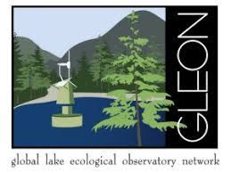

<!-- Global site tag (gtag.js) - Google Analytics -->

<!-- Sort table by multiple columns -->

<head>

<!-- tutorial on how to add a download button
https://www.w3schools.com/howto/tryit.asp?filename=tryhow_css_download_button  -->

<meta name="viewport" content="width=device-width, initial-scale=1">
<!-- Add icon library -->
<link rel="stylesheet" href="https://cdnjs.cloudflare.com/ajax/libs/font-awesome/4.7.0/css/font-awesome.min.css">

</head>

***  

### Collaborate!
***

<b>Collaborate to the GLEON project <a href="https://gleon.org/research/projects/zoosize-crustacean-zooplankton-community-size-distributions-across-worldwide-set" target="_blank"> ZooSize</a>!</b> 

ZooSize aims to get well represented individual crustacean zooplankton body length measurements for freshwater lakes across global lake thermal regions to gain insights on the following fundamental research question: 

<big>How do size distributions of crustacean zooplankton communities differ across the globe and how are they influenced by bottom-up and top-down processes? </big>
  

Read more about our question, the data requirements, and authors guidelines in our collaboration guidelines. You can download the collaboration guidelines (.pdf) and data call form (.xslx) by clicking on the buttons below. Feel free to email me or one of the other project champions (Lauren Barth and Maria Calderó-Pascual) for an example on how to fill in the data call if necessary.

<a href="files/CollaborationGuidelines_ZooSize.pdf" target="_blank" title="Download the data call instructions and authors guidelines"><button class="btn"><i class="fa fa-download"></i> Download the data call instructions  and authors guidelines</button>  </a>

<a href="files/LakeName_ZooSize.xlsx" target="_blank" title = "Download the data template"><button class="btn"><i class="fa fa-download"></i> Download the data template</button></a> 

See the timeline of the project <a href="https://docs.google.com/spreadsheets/d/1ZhrLiPbk6Rtv4yf9AaFMTSjQwlWszxK3/edit#gid=925206033" target = "_blank">here</a>. Important dates:

- October 2020: GLEON 21.5 meeting - creation of the working group ZooSize
- August 2021: Data call
- December 2021: Deadline for submission of existing data
- August 2022: Deadline for submission of data from new sampling efforts

### Contacts

Project champions: Lauren Barth (University of Toronto, Canada), <a href="https://maria-caldero-pascual.netlify.app/" target="_blank">Maria Calderó-Pascual</a> (DKIT, Ireland), <a href="https://rosalieb.github.io/rosaliebruelweb/index.html" target="_blank">Rosalie Bruel</a> (iEES-Paris, CNRS, France).

<a href='mailto:rosaliebruel@gmail.com,Maria.CalderoPascual@dkit.ie,lauren.barth@utoronto.ca'>Email us</a> if you have any question on the project.

We (<a href="https://twitter.com/CalderoPM" target="_blank">@CalderoPM</a>, <a href="https://twitter.com/LimnoLauren" target="_blank">@LimnoLauren</a>, <a href="https://twitter.com/RosalieBruel" target="_blank">@RosalieBruel</a>) will tweet some project updates on Twitter with the tag #ZooSize. 

 

<blockquote class="twitter-tweet">
<a href="https://twitter.com/GLEONetwork?ref_src=twsrc%5Etfw">@GLEONetwork</a> DATA CALL now open! Find <a href="https://twitter.com/hashtag/ZooSize?src=hash&amp;ref_src=twsrc%5Etfw">#ZooSize</a> project in <a href="https://t.co/SDRy9j9r1Q">https://t.co/SDRy9j9r1Q</a> <a href="https://twitter.com/hashtag/worldwide?src=hash&amp;ref_src=twsrc%5Etfw">#worldwide</a> <a href="https://twitter.com/hashtag/lake?src=hash&amp;ref_src=twsrc%5Etfw">#lake</a> <a href="https://twitter.com/hashtag/zooplankton?src=hash&amp;ref_src=twsrc%5Etfw">#zooplankton</a> <a href="https://twitter.com/hashtag/lenghts?src=hash&amp;ref_src=twsrc%5Etfw">#lenghts</a> Spread the word! <a href="https://twitter.com/RosalieBruel?ref_src=twsrc%5Etfw">@RosalieBruel</a> <a href="https://twitter.com/LimnoLauren?ref_src=twsrc%5Etfw">@LimnoLauren</a> <a href="https://twitter.com/SteveThackeray?ref_src=twsrc%5Etfw">@SteveThackeray</a> <a href="https://twitter.com/MECO_UniGe?ref_src=twsrc%5Etfw">@MECO_UniGe</a> <a href="https://twitter.com/PlanktonEcology?ref_src=twsrc%5Etfw">@PlanktonEcology</a> <a href="https://twitter.com/edeeyto?ref_src=twsrc%5Etfw">@edeeyto</a> <a href="https://twitter.com/MetuLimnology?ref_src=twsrc%5Etfw">@MetuLimnology</a> <a href="https://twitter.com/dvm_uvm?ref_src=twsrc%5Etfw">@dvm_uvm</a> <a href="https://twitter.com/MireiaBartrons?ref_src=twsrc%5Etfw">@MireiaBartrons</a> and many more THANKS! <a href="https://t.co/H37un4sM0u">pic.twitter.com/H37un4sM0u</a>
&mdash; Maria Calderó (@CalderoPM) <a href="https://twitter.com/CalderoPM/status/1426100249903390721?ref_src=twsrc%5Etfw">August 13, 2021</a></blockquote>  

<blockquote class="twitter-tweet">
<a href="https://twitter.com/hashtag/ZooSize?src=hash&amp;ref_src=twsrc%5Etfw">#ZooSize</a> project update: we will have our next meeting on Sept. 29, at 13:00 UTC. We will discuss ideas for a review paper we could write while waiting for data. Get in touch with us (<a href="https://twitter.com/CalderoPM?ref_src=twsrc%5Etfw">@CalderoPM</a> <a href="https://twitter.com/LimnoLauren?ref_src=twsrc%5Etfw">@LimnoLauren</a>) if you want the zoom link!  About the project: <a href="https://t.co/DIiTKNqBLZ">https://t.co/DIiTKNqBLZ</a>
&mdash; Rosalie Bruel (@RosalieBruel) <a href="https://twitter.com/RosalieBruel/status/1439972446719946759?ref_src=twsrc%5Etfw">September 20, 2021</a></blockquote>  

 

 

### Detailed log of the project  
*Click the headers to sort the table.*

<table id="myTable">
  <tr class="header">
    <th onclick="sortTable(0)">
      Date
      

      

    </th>
    <th onclick="sortTable(1)">
      What
      

      

    </th>
    <th onclick="sortTable(2)">
      Description 
      

      

    </th>
  </tr>
  <tr>
    <td>2021-02-10</td>
    <td>Meeting</td>
    <td>ZooSize general meeting.</td>
  </tr>
  <tr>
    <td>2021-03-15</td>
    <td>Meeting</td>
    <td>ZooSize general meeting.</td>
  </tr>
  <tr>
    <td>2021-06-08</td>
    <td>Meeting</td>
    <td>ZooSize general meeting.</td>
  </tr>
  <tr>
    <td>2021-09-28</td>
    <td>Meeting</td>
    <td>ZooSize general meeting.</td>
  </tr>
  <tr>
    <td>2021-10-09</td>
    <td>Meeting</td>
    <td>Adhoc meeting during GLEON-2021 (online).</td>
  </tr>
    <tr>
    <td>2021-10-21</td>
    <td>Change</td>
    <td><b>Updated the data template</b>. We had some remaining comments that had been resolved but not deleted.</td>
  </tr>
    </tr>
    <tr>
    <td>[upcoming]</td>
    <td>Change</td>
    <td>Recommended SOP for measuring zooplankton.</td>
  </tr>
</table> 

  <a href="#top"> Project's   description </a>  
   
  <a href="#contact" title="See our contacts"> Contacts </a>  
   
  <a href="#log" title="Go to the project's log"> Project's   log </a>  
   
<a href="https://twitter.com/share?ref_src=twsrc%5Etfw" class="twitter-share-button" data-text="#ZooSize - crustacean zooplankton size distribution for freshwater lakes across global lake thermal regions @CalderoPM @RosalieBruel @LimnoLauren rosalieb.github.io/rosaliebruelweb/ZooSize.html" data-lang="en" data-show-count="false">Tweet</a>
  

