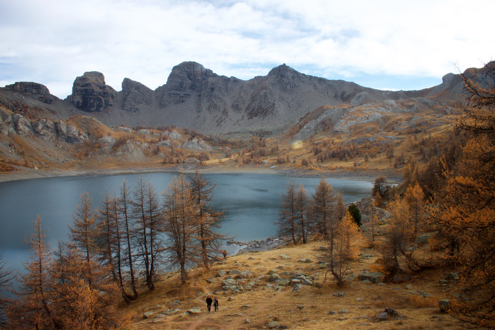
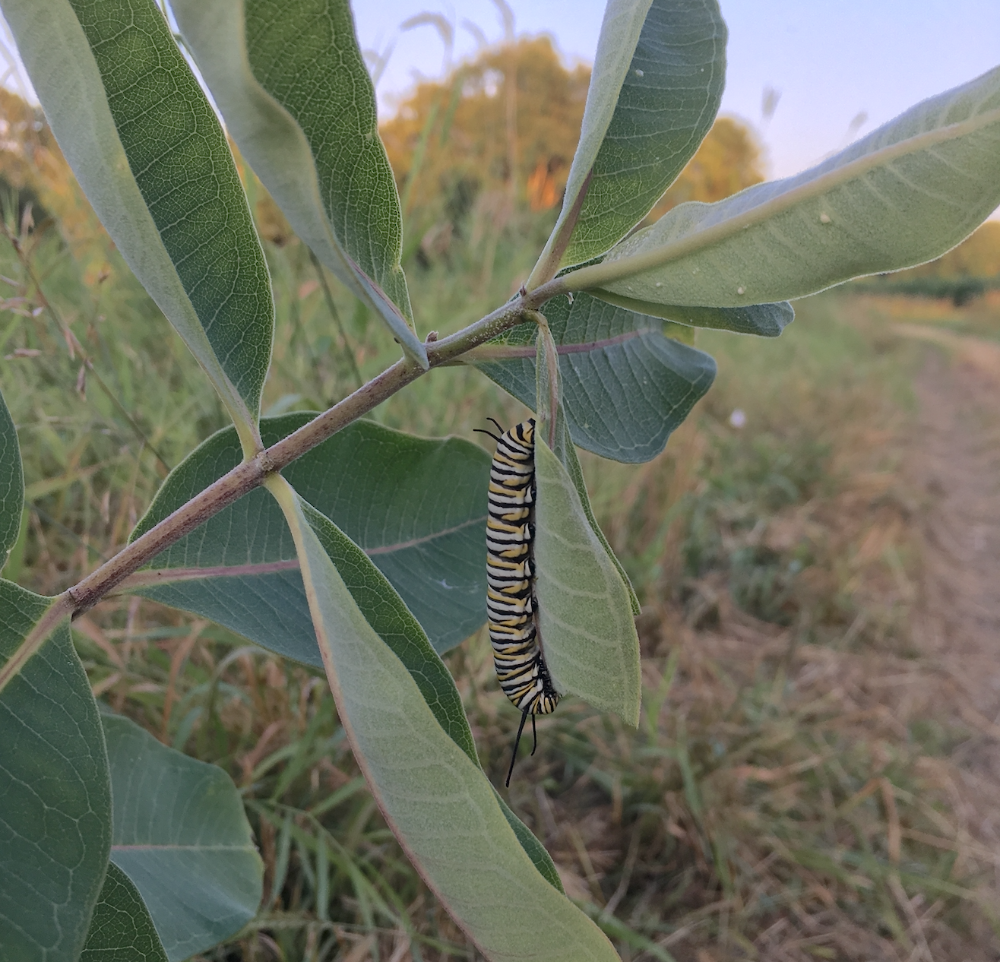
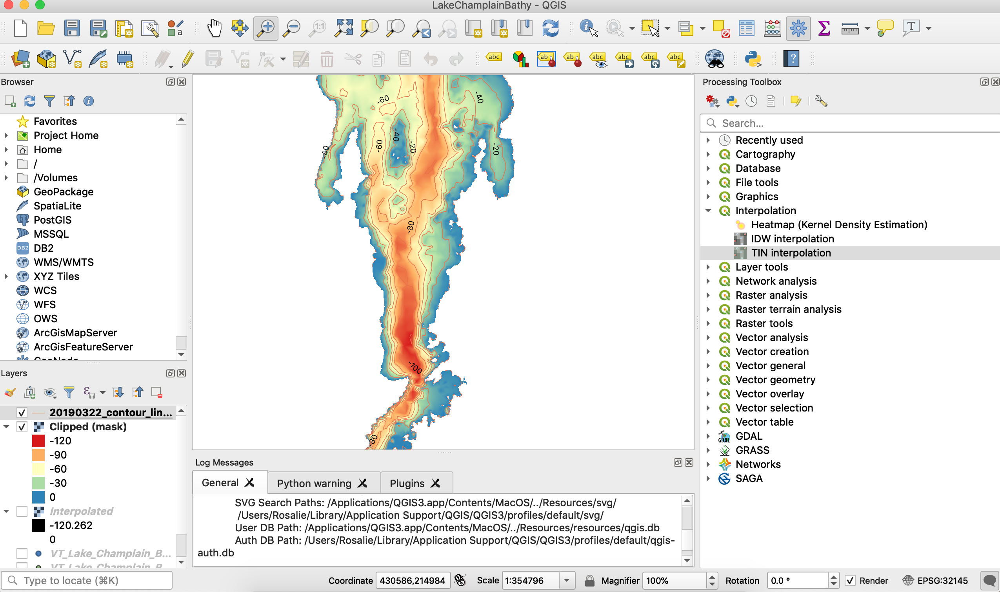
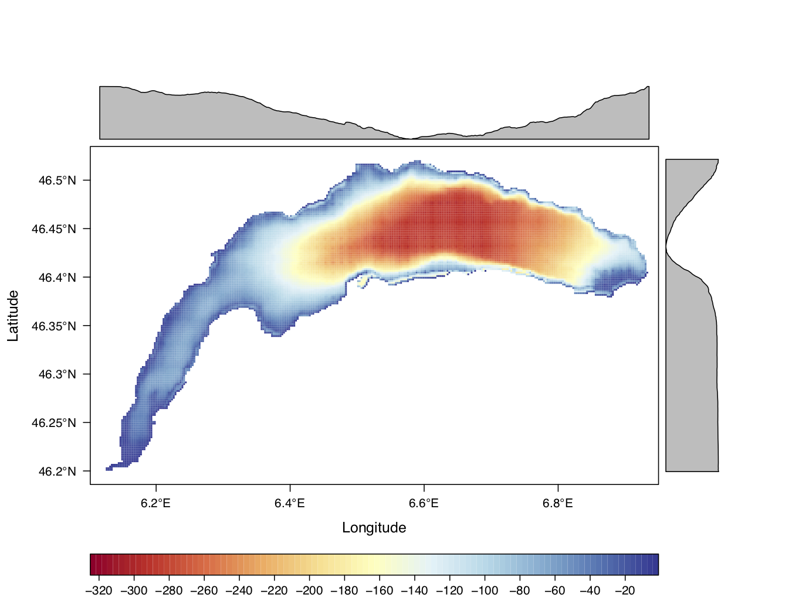
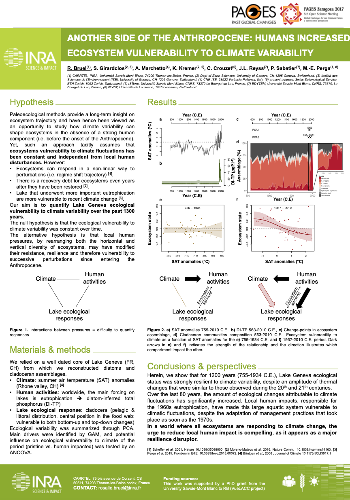

<!-- Global site tag (gtag.js) - Google Analytics -->

***  

### Blog / tutorials 
***

\n

  

  
  <h3> _get.objects.from.script()_ </h3>
  <a href="Blog_articles/Tuto7_getobjects.html">
An R function to get the objects created in an .R or .Rmd file
</a>
  

 

  

  
  <h3> _serac_ </h3>
  <a href="Blog_articles/Tuto2_serac.html">
An R package for ShortlivEd RAdionuclide chronology of recent sediment cores
</a>
  

 

  

  
  <h3> _Introduction to GitHub_ </h3>
  <a href="files/Intro_GitHub_iEES_clubstats.pdf" target="_blank">
Introduction to GitHub as part of the stat club of the iEES-Paris lab
</a>
  

  

  
  <h3>Less is more</h3>
  <a href="Blog_articles/Tuto6_less_is_more.html">
Help identifing unnecessary loaded packages in a .R or .Rmd
</a>
  

 

  

  
  <h3>QGIS3 tutorial</h3>
  <a href="Blog_articles/Tuto1_bathymetry_QGIS3.html">
Generate a bathymetry map on QGIS 3 from a XYZ csv file
</a>
  

 

  

  
  <h3>Maps in R</h3>
  <a href="Blog_articles/Tuto3_bathymetry_R.html">
Saving here some useful codes to create maps in R [work in progress]
</a>
  

 

  

  
  <h3>Analyzing large ecological datasets with R</h3>
  <a href="Blog_articles/Tuto4_useful_code_large_databases_R.html">
Random but hopefully useful bits of code to analyze large ecological datasets
</a>
  

 

  

  
  <h3>Posters</h3>
  <a href="Blog_articles/Resource0_homepage.html">
Some posters presented at conferences or else
</a>
  

\n
\n

***

 
 

***

<!-- 
 -->
### On Twitter
<!-- 
 -->
***

## Science

\n

__Presenting early results at SEFS 12__
<blockquote class="twitter-tweet">
Believe me, the rainstorm pictured below wasn&#39;t fun to be in as a human on a bike. How do such extreme storms impact freshwater phytoplankton communities?  I am presenting preliminary results on that topic today at <a href="https://twitter.com/hashtag/SEFS12?src=hash&amp;ref_src=twsrc%5Etfw">#SEFS12</a> (RS14, session starting at 11:30 CEST). <a href="https://twitter.com/GLEONetwork?ref_src=twsrc%5Etfw">@GLEONetwork</a> <a href="https://t.co/hTJYh1fzN7">pic.twitter.com/hTJYh1fzN7</a>
&mdash; Rosalie Bruel (@RosalieBruel) <a href="https://twitter.com/RosalieBruel/status/1420630750047653893?ref_src=twsrc%5Etfw">July 29, 2021</a></blockquote>  

__Variability of response of a native species to an invasive species revealed by long-term, spatially explicit, datasets__
<blockquote class="twitter-tweet">
New paper with <a href="https://twitter.com/dvm_uvm?ref_src=twsrc%5Etfw">@dvm_uvm</a> <a href="https://twitter.com/EllenMarsden2?ref_src=twsrc%5Etfw">@EllenMarsden2</a> <a href="https://twitter.com/VTFishWildlife?ref_src=twsrc%5Etfw">@VTFishWildlife</a> <a href="https://twitter.com/USFWSFisheries?ref_src=twsrc%5Etfw">@USFWSFisheries</a> <a href="https://twitter.com/SUNYPlattsburgh?ref_src=twsrc%5Etfw">@SUNYPlattsburgh</a> <a href="https://twitter.com/UVM_RSENR?ref_src=twsrc%5Etfw">@UVM_RSENR</a> published in the J. Great Lakes Res. <a href="https://twitter.com/IAGLR?ref_src=twsrc%5Etfw">@iaglr</a>  Access without suscription until July 2, 2021, and ask me beyond that: <a href="https://t.co/U7v4kPcMtM">https://t.co/U7v4kPcMtM</a> 🧵 <a href="https://t.co/mbmL7XJaLd">pic.twitter.com/mbmL7XJaLd</a>
&mdash; Rosalie Bruel (@RosalieBruel) <a href="https://twitter.com/RosalieBruel/status/1392845193225834501?ref_src=twsrc%5Etfw">May 13, 2021</a></blockquote>  

__Evidence for an early regime shift in a deep lake__
<blockquote class="twitter-tweet">
I needed some good news... so very pleased to share that our paper “Reframing Lake Geneva ecological trajectory in a context of multiple but asynchronous pressures&quot; is out in JOPL <a href="https://t.co/IB1RPROJki">https://t.co/IB1RPROJki</a>  I am so excited by the framework of this study and the methods we used. 🧵 <a href="https://t.co/VCI7hM1nXc">pic.twitter.com/VCI7hM1nXc</a>
&mdash; Rosalie Bruel (@RosalieBruel) <a href="https://twitter.com/RosalieBruel/status/1354971074748948486?ref_src=twsrc%5Etfw">January 29, 2021</a></blockquote>  

__*serac*, an R package for you short-lived radionuclides age-depth models needs__
<blockquote class="twitter-tweet">
Our paper describing our R package serac is out! serac provides a fast and reproducible way to compute the most popular age depth models based on 210Pb measurements.  Download for free before Dec. 13 using this link: <a href="https://t.co/2l2ePvs937">https://t.co/2l2ePvs937</a><a href="https://twitter.com/hashtag/rstats?src=hash&amp;ref_src=twsrc%5Etfw">#rstats</a> <a href="https://twitter.com/hashtag/serac?src=hash&amp;ref_src=twsrc%5Etfw">#serac</a>
&mdash; Rosalie Bruel (@RosalieBruel) <a href="https://twitter.com/RosalieBruel/status/1320111416909746179?ref_src=twsrc%5Etfw">October 24, 2020</a></blockquote>  

__Sub-sampling strategie for time-series__
<blockquote class="twitter-tweet">
We reckon there are more important news this week, but here is our paper, online today in Ecological Indicators! Offering food for thoughts on sampling design when the objective is to detect change points in ecological time series. <a href="https://t.co/1DVO7q9lWt">https://t.co/1DVO7q9lWt</a>  cc <a href="https://twitter.com/eastonrwhite?ref_src=twsrc%5Etfw">@eastonrwhite</a> <a href="https://t.co/CZvdK9alLh">pic.twitter.com/CZvdK9alLh</a>
&mdash; Rosalie Bruel (@RosalieBruel) <a href="https://twitter.com/RosalieBruel/status/1324718134817861634?ref_src=twsrc%5Etfw">November 6, 2020</a></blockquote>  

__GLEON20, Student workshop, Rottnest Island, Western Australia__
<blockquote class="twitter-tweet">
Kicking off the <a href="https://twitter.com/hashtag/GLEON20?src=hash&amp;ref_src=twsrc%5Etfw">#GLEON20</a> Student Association workshop with <a href="https://twitter.com/MEL_Phytos?ref_src=twsrc%5Etfw">@MEL_Phytos</a> and Sami Khan. <a href="https://twitter.com/RosalieBruel?ref_src=twsrc%5Etfw">@RosalieBruel</a> giving an excellent introduction to <a href="https://twitter.com/github?ref_src=twsrc%5Etfw">@github</a> <a href="https://twitter.com/GLEONetwork?ref_src=twsrc%5Etfw">@GLEONetwork</a> <a href="https://t.co/XDD9uX9OFk">pic.twitter.com/XDD9uX9OFk</a>
&mdash; Jonathan Doubek (@jondoubek) <a href="https://twitter.com/jondoubek/status/1069441559744065536?ref_src=twsrc%5Etfw">December 3, 2018</a></blockquote> 

\n
__QUAPAL18 - presenting our work on Lake Geneva__
<blockquote class="twitter-tweet">
1 <a href="https://twitter.com/hashtag/QUAPAL18?src=hash&amp;ref_src=twsrc%5Etfw">#QUAPAL18</a> Assessing ecosystems resistance to air temperature warming requires long periods of times. Regarding the multiplicity of stressors in the Anthropocene, can we use past responses to climate as an analogue for future evolution of ecosystems? <a href="https://t.co/cn2kcPfak4">pic.twitter.com/cn2kcPfak4</a>
&mdash; Rosalie Bruel (@RosalieBruel) <a href="https://twitter.com/RosalieBruel/status/1006862504746737665?ref_src=twsrc%5Etfw">June 13, 2018</a></blockquote> 

\n
__My first paper!__
<blockquote class="twitter-tweet">
Our paper “Seeking alternative stable states in a deep lake” published in <a href="https://twitter.com/hashtag/Freshwater?src=hash&amp;ref_src=twsrc%5Etfw">#Freshwater</a> <a href="https://twitter.com/hashtag/Biology?src=hash&amp;ref_src=twsrc%5Etfw">#Biology</a> is now available in Early Views! You can read it from here: <a href="https://t.co/tJJb6X8rqE">https://t.co/tJJb6X8rqE</a>. 👇Thread on what we did👇, please RT! <a href="https://twitter.com/MEPerga?ref_src=twsrc%5Etfw">@MEPerga</a> <a href="https://twitter.com/UmrCarrtel?ref_src=twsrc%5Etfw">@UMRCARRTEL</a> <a href="https://t.co/4TyoyfVrsY">pic.twitter.com/4TyoyfVrsY</a>
&mdash; Rosalie Bruel (@RosalieBruel) <a href="https://twitter.com/RosalieBruel/status/969249591685246976?ref_src=twsrc%5Etfw">March 1, 2018</a></blockquote> 

## Life at the lab

\n

  

__About paper (co)authorhip ✍️__
<blockquote class="twitter-tweet" data-lang="fr">
This morning during <a href="https://twitter.com/EllenMarsden2?ref_src=twsrc%5Etfw">@EllenMarsden2</a> and <a href="https://twitter.com/dvm_uvm?ref_src=twsrc%5Etfw">@dvm_uvm</a> lab meeting, we discussed authorship in scientific papers. There&#39;s a lot of unspoken codes that can seem a bit obscure when you enter academia at first. The following thread gathers things I remember from the discussion <a href="https://twitter.com/hashtag/phdchat?src=hash&amp;ref_src=twsrc%5Etfw">#phdchat</a> 1/
&mdash; Rosalie Bruel (@RosalieBruel) <a href="https://twitter.com/RosalieBruel/status/1108541911378419712?ref_src=twsrc%5Etfw">21 mars 2019</a></blockquote>  

\n
__Helping Ben Block (UVM-RESL Graduate student)__
<blockquote class="twitter-tweet">
Went this morning with some folks from <a href="https://twitter.com/UVM_RSENR?ref_src=twsrc%5Etfw">@UVM_RSENR</a> to try out the ice jigger <a href="https://twitter.com/BentheEcologist?ref_src=twsrc%5Etfw">@BentheEcologist</a> will use to catch fish and study their diets over the winter. Clever adaptations of the equipment and thick ice were involved. <a href="https://t.co/410wyi49ra">pic.twitter.com/410wyi49ra</a>
&mdash; Rosalie Bruel (@RosalieBruel) <a href="https://twitter.com/RosalieBruel/status/1085668742271508487?ref_src=twsrc%5Etfw">January 16, 2019</a></blockquote> 

\n
__Helping Natalie Flores (UVM-RESL Graduate student)__
<blockquote class="twitter-tweet">
This morning, Kerry (an undergrad student) and I woke up early to go help <a href="https://twitter.com/NatalieMFlo?ref_src=twsrc%5Etfw">@NatalieMFlo</a> on the field, at Shelburne Pond, VT. <a href="https://t.co/YlK6ukOHkZ">pic.twitter.com/YlK6ukOHkZ</a>
&mdash; Rosalie Bruel (@RosalieBruel) <a href="https://twitter.com/RosalieBruel/status/1038781427842789376?ref_src=twsrc%5Etfw">September 9, 2018</a></blockquote> 

## Public outreach

\n

  

__Host for @LaBioauLabo during one week__
<blockquote class="twitter-tweet">
[admin] Bonjour à tous ! Cette semaine c’est <a href="https://twitter.com/RosalieBruel?ref_src=twsrc%5Etfw">@RosalieBruel</a>, doctorante <a href="https://twitter.com/Inra_France?ref_src=twsrc%5Etfw">@Inra_France</a> <a href="https://twitter.com/Univ_Savoie?ref_src=twsrc%5Etfw">@Univ_Savoie</a> <a href="https://twitter.com/UmrCarrtel?ref_src=twsrc%5Etfw">@UmrCarrtel</a> qui sera avec nous.  Retrouvez sa bio sur le site<a href="https://t.co/qG5GkBcFqf">https://t.co/qG5GkBcFqf</a>… <a href="https://t.co/pfMXpAzRiK">pic.twitter.com/pfMXpAzRiK</a>
&mdash; La Bio au Labo (@laBioauLabo) <a href="https://twitter.com/laBioauLabo/status/980716083685584896?ref_src=twsrc%5Etfw">April 2, 2018</a></blockquote> 

