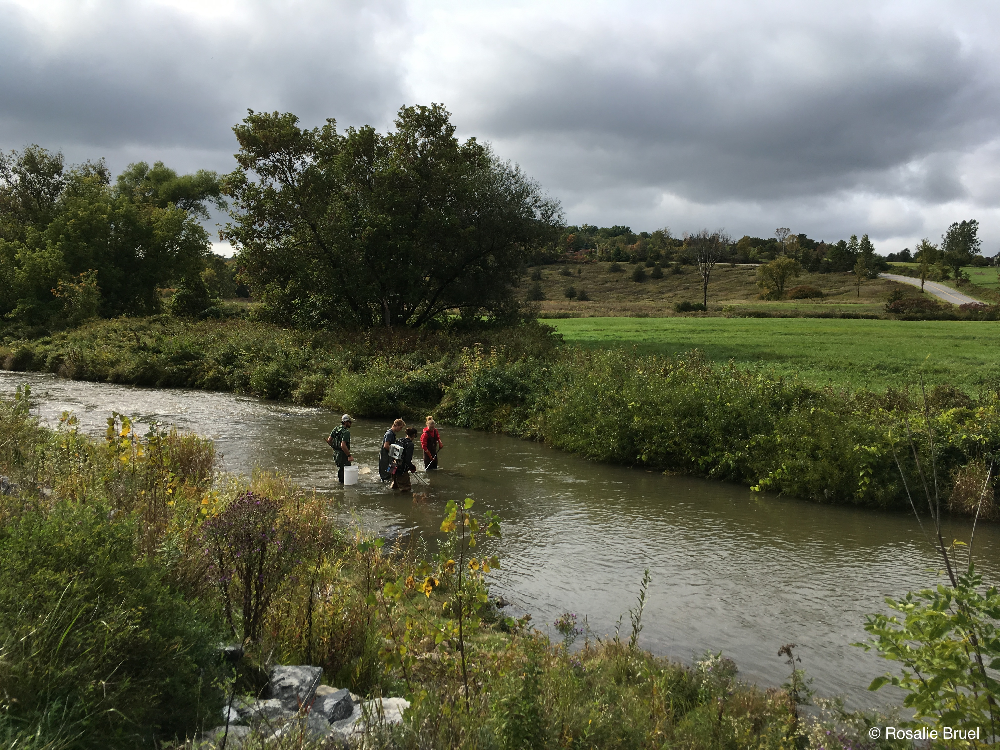
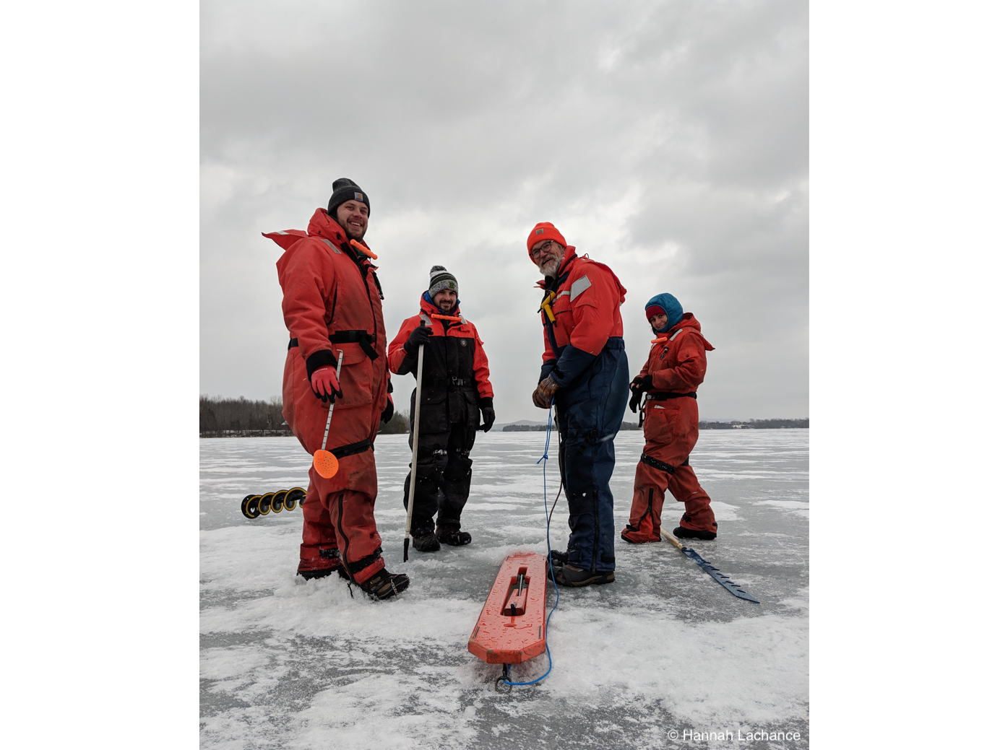
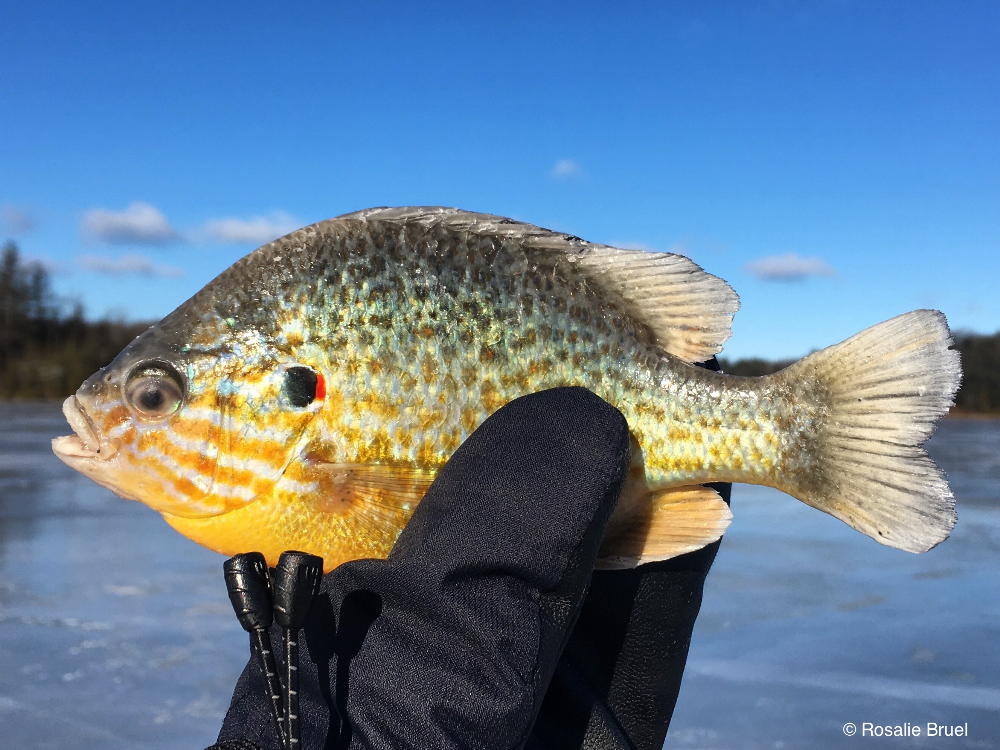
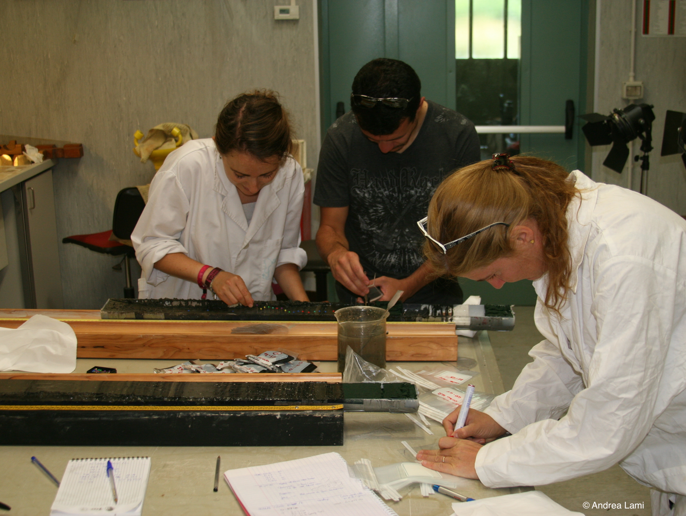

\n

<html>
<head>
<meta name="viewport" content="width=device-width, initial-scale=1">

</head>

<body>

***  

### A few snapshots
***

<!-- Container for the image gallery -->

<!-- Full-width images with number text -->

  
1 / 6

  

  
2 / 6

  

  
3 / 6

  

  

  
4 / 6

  

  
5 / 6

  

  
6 / 6

  

  
<a class="prev" onclick="plusSlides(-1)">❮</a>
<a class="next" onclick="plusSlides(1)">❯</a>
  

  

  

  

  
  

  

  
  

  

  
  

  

  
  

  

  
  
    
  

  
  

</body>
</html> 