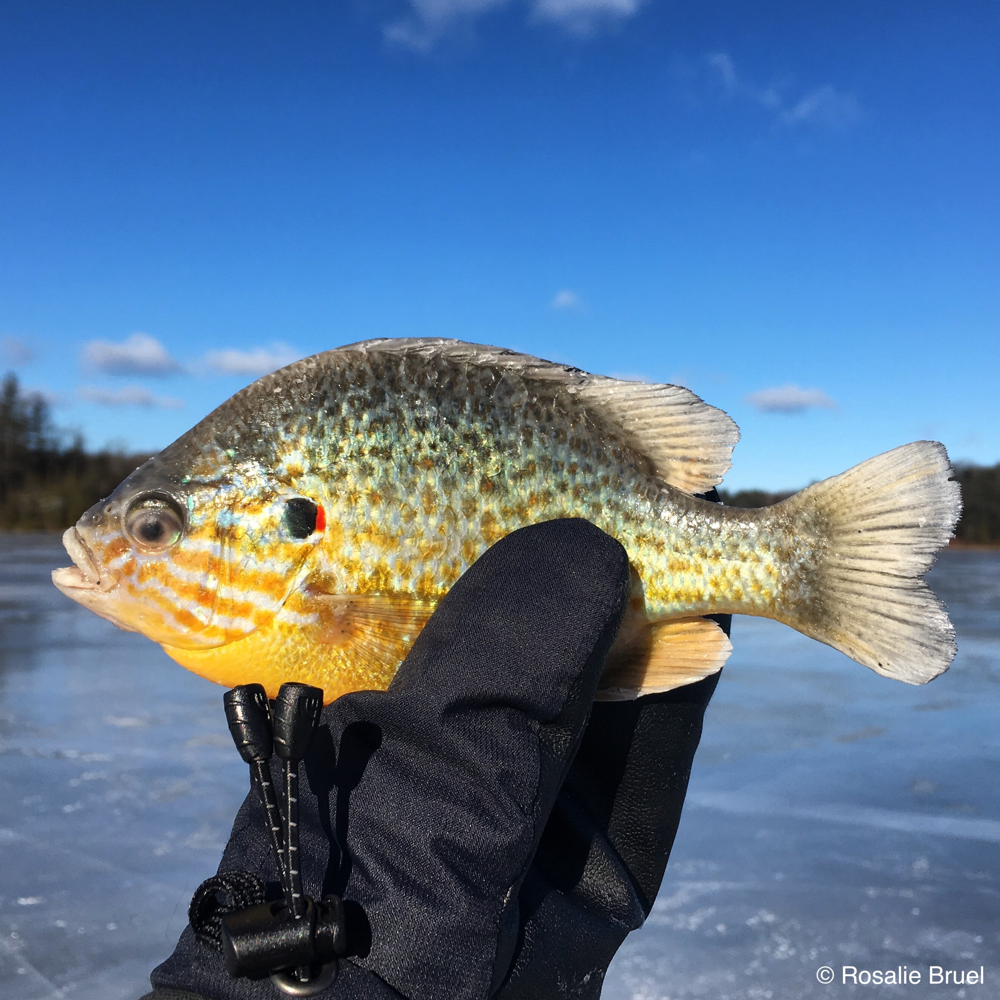

---
---

<link rel="stylesheet" href="styles.css" type="text/css">

<!-- Global site tag (gtag.js) - Google Analytics -->

My research initially focused on how heavily anthropogenised ecosystems respond to climatic perturbations. I have worked on lowland and high-altitude lakes at different temporal scales (millennial to sub-hourly resolution) on different responses (physical, chemical, biological). Currently, I am developing a food web model for Lake Champlain. The objective is to quantify how changes in food web structure affect the system functioning. Specific questions include spatial and temporal aspects: (1) Does the heterogeneity of Lake Champlain promote various equilibria? (2) Does the spatiality reflect several thresholds in environmental parameters? (3) What changes in environmental conditions allowed the natural recruitment of lake trout to start in the 2010s after decades of no recruits? (4) How might possible changes in fish stocking policies  impact the Lake Champlain food web?

\n
\n

<a class="twitter-timeline" href="https://twitter.com/RosalieBruel">Tweets by Rosalie</a> 

\n
\n

