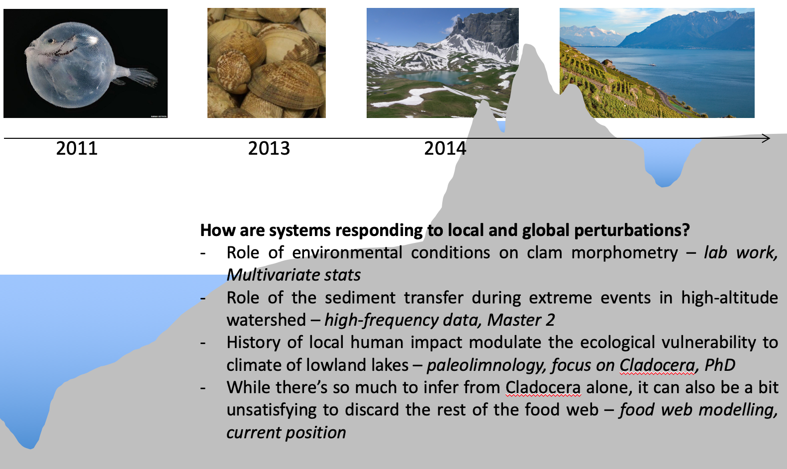

<!-- Global site tag (gtag.js) - Google Analytics -->

\n
\n

In 2011, I took a course in Marine Biology at Napier University (Edinburgh), where we learned about deep seas organisms (among other things). I found them fascinating (who wouldn't...). This is partly what made me choose my Master in Aquatic Ecology. During my first internship, I ended up working relatively far from the deap seas, as I worked on clams in a bay (Arcachon Bay, 10 m bsl). But things got out of control when I studied seasonal dynamics of high-altitude lake (Lake Anterne, 2,063 m asl) during my 2nd year. Of course, these internships were fascinating. While I will forever struggle with the gulf between everything I'd like to study and the average human life expectancy, my research interests now revolve around how systems are responding to local and global perturbations. This general thematic gets my interest because there's opportunity for both fundamental and applied research.

<head><b>Publications</b> (<a href="https://orcid.org/0000-0001-8351-7539" target="_blank">ORCID profile</a> for the most up-to-date list):</head> 

<ol reversed>
<li><b>Bruel, R.</b>, Sabatier, P., 2020. serac: a R package for ShortlivEd RAdionuclide Chronology of recent sediment cores. Journal of Environmental Radioactivity (manuscript in production) <a href="https://eartharxiv.org/f4yma/">Preprint on EarthArXiv in the meantime</a></li>

<li>Perga, M.-E., <b>Bruel, R.</b>, Rodriguez, L., Guénand, Y., Bouffard, D., 2018. Storm impacts on alpine lakes: antecedent weather conditions matter more than the event intensity. Glob. Change Biol. <a href="https://doi.org/10.1111/gcb.14384"> DOI: 10.1111/gcb.14384</a>
&nbsp;&nbsp;&nbsp;&nbsp;</li>

<li><b>Bruel, R.</b>, Marchetto, A., Bernard, A., Lami, A., Sabatier, P., Frossard, V., Perga, M.-E., 2018. Seeking alternative stable states in a deep lake. Freshwater Biology. <a href="https://doi.org/10.1111/fwb.13093">DOI: 10.1111/fwb.13093 </a> </li>
</ol>

<head><b>Preprints:</b></head>
&nbsp;&nbsp;&nbsp;&nbsp;
<ol reversed>
<li><b>Bruel, R.</b>, Marsden, J. E., Pientka, B., Staats, N., Mihuc, T., Stockwell, J. D., 2020. Rainbow smelt population responses to species invasions and change in environmental condition. bioRxiv. <a href="https://www.biorxiv.org/content/10.1101/2020.10.08.332205v1">DOI: 10.1101/2020.10.08.332205</a></li>

<li><b>Bruel, R.</b>, White, E. R., 2020. Sampling requirements and approaches to detect ecosystem shifts. bioRxiv. <a href="https://doi.org/10.1101/2020.04.07.030643">DOI: 10.1101/2020.04.07.030643</a></li>

<li><b>Bruel, R.</b>, Girardclos, S., Marchetto, A., Kremer, K., Crouzet, C., Reyss, J.-L., Sabatier, P., Perga, M.-E., 2019. Reframing Lake Geneva ecological trajectory in a context of multiple but asynchronous drivers. EarthArXiv. <a href="https://eartharxiv.org/j8up3/">DOI: 10.31223/osf.io/j8up3</a></li>
</ol>

My trajectory over the years in a nutshell ↓

