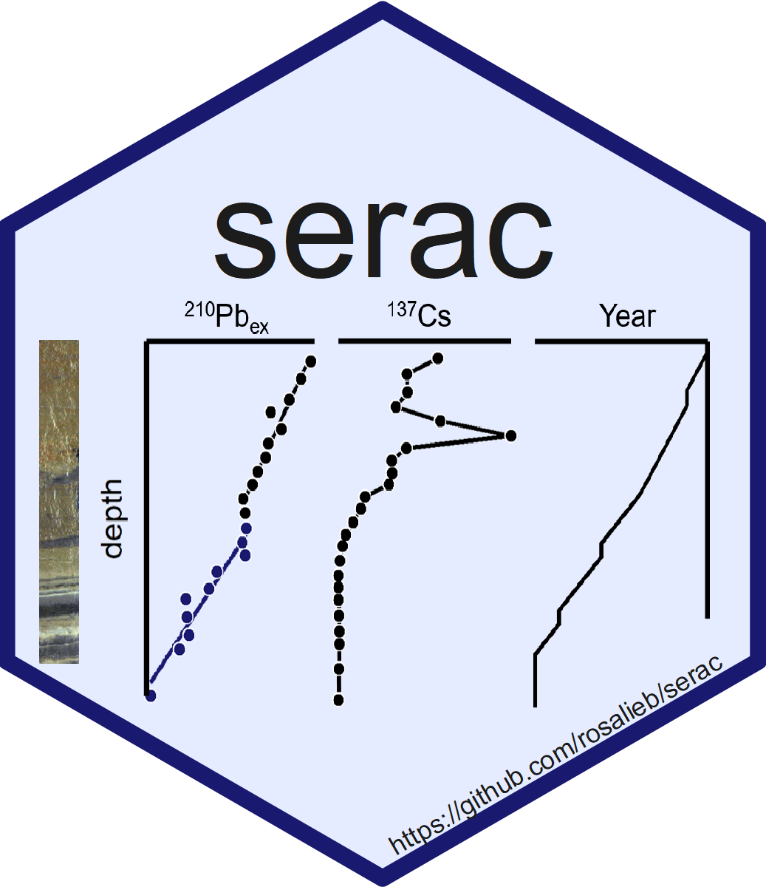
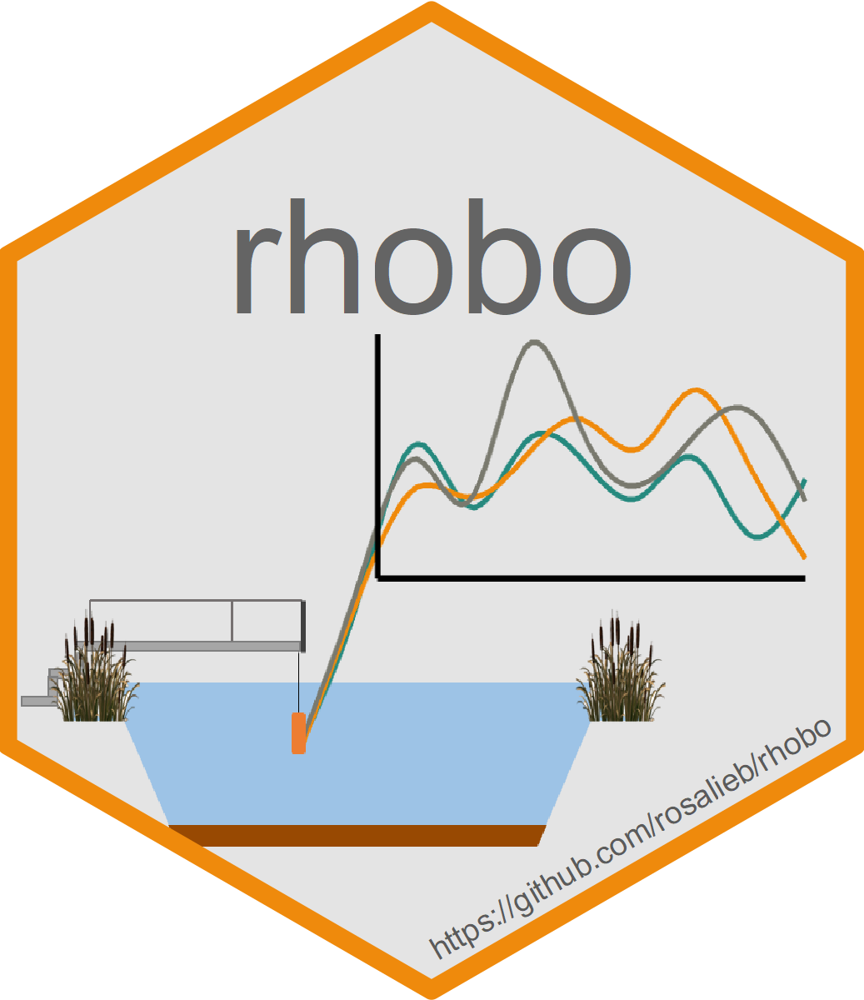

<!-- Global site tag (gtag.js) - Google Analytics -->

<!-- Have the title display in the tab name, but not on the html page  -->

***  

### Coding/programming
***

When I first used R, I would have never thought I would like it that much (heard that before?). I do most of my work in R because I don't have any limitation in term of analyses, and it grants reproducibility of my results. I am also very reluctant to use any software that is not freely available, because it limits potential collaboration.

My GitHub gathers some of my past and current projects. While you're here, have a look at:

* The code to reproduce the analyses from our paper <a href="https://www.researchgate.net/publication/323394346_Seeking_alternative_stable_states_in_a_deep_lake" target="_blank">'Seeking alternative stable states in a deep lake'</a> (Bruel et al, 2018) is available <a href="https://github.com/rosalieb/AltStableStates" target="_blank">here</a>.
* Our R package <a href="https://github.com/rosalieb/serac" target="_blank">_serac_</a>. See the accompanying paper in Journal of Environmental Radioactivity (Bruel & Sabatier, 2020). <a href="https://eartharxiv.org/f4yma/">Link to the preprint</a> (DOI: 10.31223/osf.io/f4yma).
* The code to reproduce the analyses from our paper <a href="https://www.sciencedirect.com/science/article/pii/S1470160X20310359" target="_blank">'Sampling requirements and approaches to detect ecosystem shifts'</a> (Bruel & White, 2021) is available <a href="https://github.com/rosalieb/temporal-sampling" target="_blank">here</a>.
* The code to reproduce this website is on my GitHub as well, <a href="https://github.com/rosalieb/rosaliebruelweb" target="_blank">here</a>. I used <a href="https://www.emilyzabor.com/tutorials/rmarkdown_websites_tutorial.html">Emily C. Zabor's tutorial</a>.
* Our R package <a href="https://github.com/rosalieb/rhobo" target="_blank">_rhobo_</a>, developped with Sophie Guillon (Mines ParisTech) to handle and calibrate HOBO data from the PLANAQUA lake-mesocosmsat the [CEREEP-Ecotron](https://www.cereep.bio.ens.psl.eu/spip.php?article45). 

    

